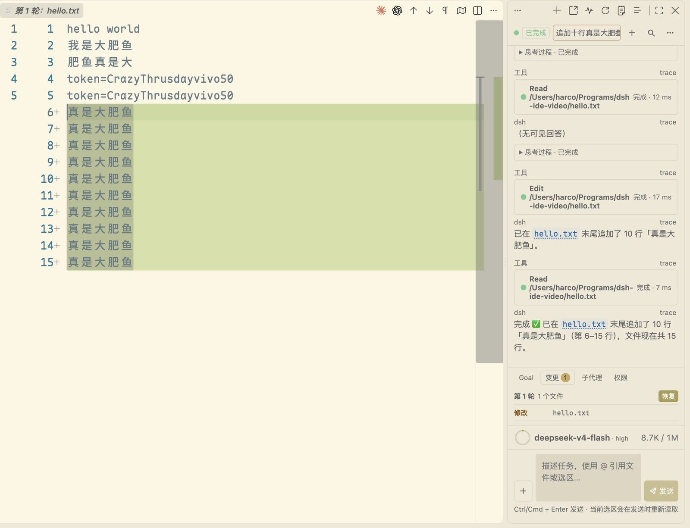
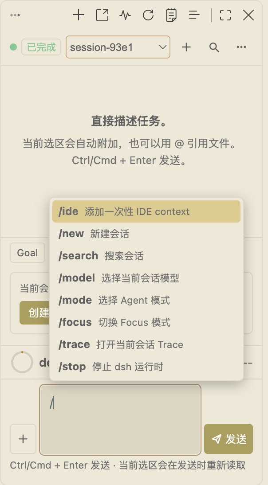
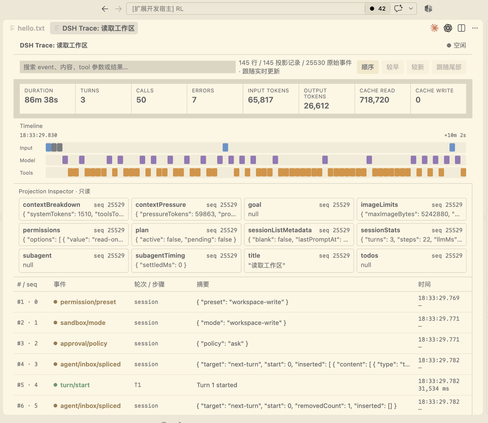
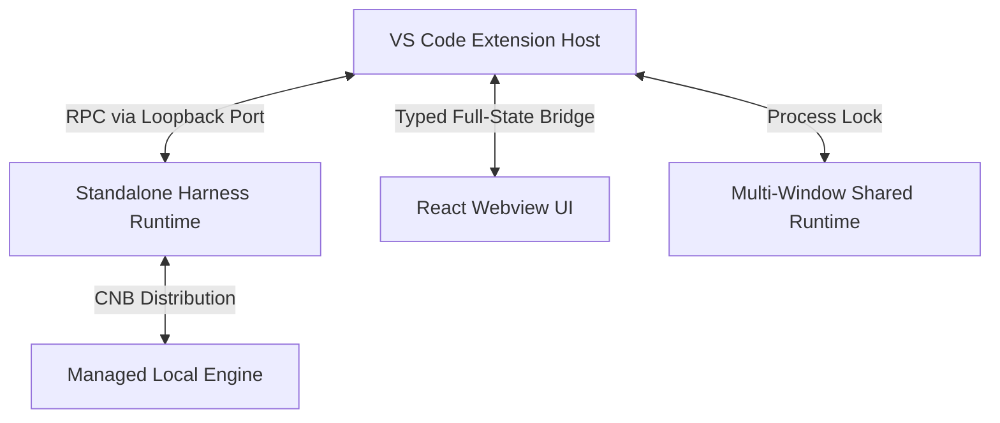

<p align="center">
  
</p>

<h1 align="center">DSH VSCode Integration</h1>

<p align="center">
  DSH integration for VS Code with native diff previews, real-time balance, and built-in Trace analysis.
</p>

<p align="center">
  <strong>English</strong> | <a href="README.zh-CN.md">简体中文</a>
</p>

<p align="center">
  <a href="https://open-vsx.org/extension/harcochen/dsh-vsc-integration"></a>
  <a href="https://marketplace.visualstudio.com/items?itemName=HarcoChen.dsh-vsc-integration"></a>
  <a href="https://github.com/HarcoChen/dsh-vsc-integration/stargazers"></a>
  <a href="https://github.com/HarcoChen/dsh-vsc-integration/blob/main/LICENSE"></a>
</p>

<p align="center">
  <em>An independent community project. <a href="https://github.com/HarcoChen/dsh-vsc-integration/issues">Issues</a> welcome.</em>
</p>

<p align="center">
  
</p>

## Quick start

1. **Install the extension** — [from the VS Code Marketplace](https://marketplace.visualstudio.com/items?itemName=HarcoChen.dsh-vsc-integration), or search `DSH` in the Extensions panel.
2. **Choose a workspace and start chatting** — configure the workspace as prompted, then ask away.

## Features

### Native diff for every edit, no Git required

After a `write`/`edit` tool call, open the target file to see VS Code's native side-by-side diff. The before-image is reconstructed by replaying hunks backwards from the Session log, so it also works in non-Git repositories and Git-ignored files.



### Preview before approval

The approval card shows the actual command line, working directory, and target files that will be written. You can inspect every change in full before allowing it.

### Slash commands enumerated live from the Runtime

The slash menu dynamically fetches commands registered by the Runtime for the current session (`/plan`, `/compact`, `/goal`, etc.) and merges them with the extension's own IDE commands.



### Editor and Git context

- Right-click the current file, selection, or Git diff to explain, fix, review, or generate documentation.
- Right-click `Ask about resource` in Explorer to ask about a file or folder.
- The `@` menu autocompletes workspace files and previous Sessions.
- `DSH: Capture AppShot` (macOS only) captures a window screenshot and inserts it into the conversation as a draft.

### Sessions, Trace, and Activity at a glance

The sidebar provides a native conversation-outline TreeView. Trace, token usage, Todo lists, and subagents are gathered in the Activity panel. The UI supports VS Code's dark and light themes.



### Credentials and balance

The bottom bar shows your current balance, including peak and off-peak pricing. Low balances are highlighted clearly.


## Architecture and runtime

Multiple VS Code windows preferentially reuse the same local Harness Runtime. The Runtime launched by the extension publishes a random loopback port through a process lock; later windows connect directly, avoiding competing writes.



## Configuration

Search `dsh` in VS Code settings for the full list.

| Setting | Default | What it does |
| --- | --- | --- |
| `dsh.serverUrl` | `""` | URL of an already running dsh web Runtime; when set, the extension connects directly. |
| `dsh.autoStart` | `true` | Automatically start or connect to dsh web when the extension activates. |
| `dsh.installWhenMissing` | `true` | Automatically download and manage a standalone Runtime when no usable npm/dsh environment is available. |
| `dsh.runtimeVersion` | `0.1.1-rc.2` | Locked version of the managed Runtime. |
| `dsh.npmRegistry` | `https://registry.npmmirror.com` | Registry mirror used as a download fallback. |
| `dsh.npxTimeoutMs` | `120000` | Timeout while waiting for package-manager download and startup. |
| `dsh.maxContextBytes` | `120000` | Maximum UTF-8 bytes of `<ide_context>` included per prompt. |
| `dsh.persistSession` | `true` | Reuse the previous Session ID for the current workspace when possible. |
| `dsh.agentStatusLabels` | *fat-whale messages* | Random text shown during each streaming turn; customizable. |
| `dsh.agentStatusLabel` | `""` | Pins a single fixed status line when set. |
| `dsh.enableEffortKnob` | `true` | Use the runner sprite animation as the reasoning-effort slider button. |

## Other ways to install

**From GitHub Releases** — download the `.vsix` from [Releases](https://github.com/HarcoChen/dsh-vsc-integration/releases) and run `Extensions: Install from VSIX...`. Pre-release builds are published only to GitHub Releases.

**Build from source**:

```bash
npm install
npm run check
npm run package
```

Then install the generated `.vsix` via `Extensions: Install from VSIX...`.

## Extension API

Other VS Code extensions can hook into the API DSH exports.

<details>
<summary><strong>Conversation navigation API</strong> — register custom nodes</summary>

```ts
const registration = api.registerConversationNavigation([
    { seq: 42, label: "Review the PPO implementation", detail: "Training config" },
]);
context.subscriptions.push(registration);
```

</details>

<details>
<summary><strong>Agent status label API</strong> — customize streaming status text</summary>

```ts
const dsh = vscode.extensions.getExtension<import("dsh-vsc-integration").DshExtensionApi>(
    "harcochen.dsh-vsc-integration",
);
const api = await dsh?.activate();
context.subscriptions.push(
    api?.registerAgentStatusPresentation({ label: "🐋 Diving" }),
);
```

</details>

## Development and testing

```bash
npm install
npm run check      # TypeScript check (host + webview)
npm test           # Release gate: webview check + compile + test suite
npm run compile    # Build to dist/
npm run package    # Compile + vsce package
npm run release    # Test + version bump + CHANGELOG archive + tag
```

To verify the managed Runtime release logic:

```bash
node scripts/verify-managed-runtime.mjs              # remote contract only
node scripts/verify-managed-runtime.mjs --full       # install and smoke-test
```

## More information

- [Changelog](CHANGELOG.md)
- [Product TODO](TODO.md)
- [Third-party notices](THIRD_PARTY_NOTICES.md)

## Acknowledgments

Thanks to [dsh-reasoning-effort](https://github.com/HanaAyane/dsh-reasoning-effort) for the chibi runner sprite reference. The conversation outline takes inspiration from the `dsh-milestone` project.

## License

[MIT](LICENSE)
