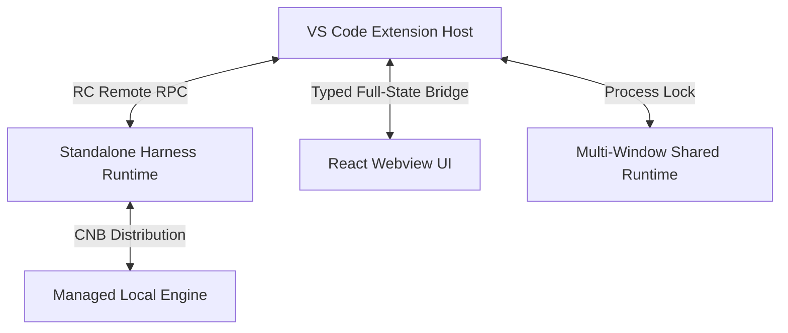

<p align="center">
  
</p>

<h1 align="center">DeepSeek Harness for VS Code</h1>

<p align="center">
  <strong>Your coding agent, with every change in view.</strong><br>
  Bring DeepSeek Harness (DSH) into VS Code: work with your code, review native diffs, and follow each task with built-in Trace and usage insights.
</p>

<p align="center">
  <strong>English</strong> | <a href="README.zh-CN.md">简体中文</a>
</p>

<p align="center">
  <a href="https://open-vsx.org/extension/harcochen/dsh-vsc-integration"></a>
  <a href="https://marketplace.visualstudio.com/items?itemName=HarcoChen.dsh-vsc-integration"></a>
  <a href="https://github.com/HarcoChen/dsh-vsc-integration/stargazers"></a>
  <a href="https://github.com/HarcoChen/dsh-vsc-integration/blob/main/LICENSE"></a>
</p>

<p align="center">
  <a href="https://marketplace.visualstudio.com/items?itemName=HarcoChen.dsh-vsc-integration"><strong>Install for VS Code</strong></a> ·
  <a href="https://open-vsx.org/extension/harcochen/dsh-vsc-integration">Open VSX</a> ·
  <a href="https://github.com/HarcoChen/dsh-vsc-integration/releases">Download VSIX</a> ·
  <a href="CHANGELOG.md">Changelog</a>
</p>

<p align="center">
  <em>An independent community project. <a href="https://github.com/HarcoChen/dsh-vsc-integration/issues">Issues</a> welcome.</em>
</p>

<p align="center">
  For JetBrains IDEs (IDEA, PyCharm, etc.), please see <a href="https://github.com/HarcoChen/dsh-intellij-integration">dsh-intellij-integration</a>.
</p>

<p align="center">
  
</p>

## Why DSH?

- **See what changed.** Review tool edits in VS Code's native side-by-side diff, even outside a Git repository.
- **Decide before execution.** Approval cards show commands and target files, with proposed diffs for supported file writes.
- **Start with context.** Bring files, selections, Git diffs, or paused debugger state into a task without copying everything by hand.
- **Pick up where you left off.** Resume persistent sessions and follow tools, subagents, Todos, and token usage in the Activity panel.

## Quick start

Requires **VS Code 1.106.0 or later** and a configured DSH model provider with credentials.

1. **Install the extension** from the Marketplace or Open VSX links above, or search for `harcochen.dsh-vsc-integration` in Extensions.
2. **Open chat.** Open and trust your project folder, then run `DSH: Open Chat` from the Command Palette. The extension automatically starts or connects to a Runtime; by default, it attempts a managed Runtime download when no usable environment is available.
3. **Set up your provider.** Run `DSH: Configure API Key` for DeepSeek credentials. For other providers, use `DSH: Open dsh Web UI in Browser`. Select or register a DSH Workspace, then choose a model.
4. **Give it a task.** Type `@` to reference a file, or right-click a selection for DSH actions. Follow the task, respond to approval requests, and open diffs from tool cards to review the result.

> A **DSH Workspace** groups sessions in Harness and can be associated with a project path. When using the same Runtime, you can continue sessions created in the Web UI.

### Try it on real work

| Your task | A place to start |
| --- | --- |
| Understand unfamiliar code | Select code and use the DSH explain action: “Walk through the execution flow and edge cases.” |
| Review a change | Use the DSH review action on a Git diff in Source Control: “Check these changes for regressions and point to the relevant lines.” |
| Investigate a breakpoint | While paused, run `DSH: Explain Current Debug State` to attach context including the call stack and local variables. |
| Continue earlier work | Switch to a previous session and use the conversation outline to revisit the discussion. |

## Features

### Native diff for every edit, no Git required

After a `write`/`edit` tool call, open the target file to see VS Code's native side-by-side diff. The before-image is reconstructed by replaying hunks backwards from the Session log, so it also works in non-Git repositories and Git-ignored files.


### Preview before approval

The approval card shows the actual command line, working directory, and target files that will be written. For supported file-writing tools, open a native diff of the proposed change before approving it.

A write whose target file still has unsaved editor changes is not released: approval is refused, the card names the files and stays pending, and you can save or revert them and approve again.

### Slash commands enumerated live from the Runtime

The slash menu dynamically fetches commands registered by the Runtime for the current session (`/plan`, `/compact`, `/goal`, etc.) and merges them with the extension's own IDE commands.


### Editor and Git context

- Right-click the current file, selection, or Git diff to explain, fix, review, or generate documentation.
- Right-click `Ask about resource` in Explorer to ask about a file or folder.
- The `@` menu autocompletes project files and previous Sessions.
- `DSH: Capture AppShot` (macOS only) captures a window screenshot and inserts it into the conversation as a draft.

### Sessions, Trace, and Activity at a glance

The sidebar provides a native conversation-outline TreeView. Trace, token usage, Todo lists, and subagents are gathered in the Activity panel. The UI supports VS Code's dark and light themes.

`DSH: Open Chat in Editor Tab` mirrors the same conversation in an editor tab, so the chat can sit next to the file you are editing. Both surfaces show one session and one stream — switching between them does not restart or fork anything.


### Autonomous debugging (off by default)

With `dsh.autonomousDebugging` enabled, the extension exposes a loopback MCP endpoint inside
this window and the agent can drive the VS Code debugger: `debug_start` launches a launch
configuration that already exists in the workspace, `debug_breakpoint` adds, removes and lists
breakpoints, `debug_control` continues, steps and waits for the next pause, and `debug_context`
reads the paused stack, variables and source. Variables whose names look like secrets are
replaced with `[redacted by dsh-ide]` before they leave the window. The endpoint binds
`127.0.0.1` only, checks the `Host` header and a per-launch token, and never lets the model
invent a launch configuration. It applies to a Runtime this window starts; switching the setting
needs a Runtime restart, which the extension offers when you change it.

### Credentials and balance

The bottom bar shows your current balance, including peak and off-peak pricing. Low balances are highlighted clearly.


## FAQ

**Do I need to install DSH manually?** Usually no. The extension looks for a usable local environment and attempts to download a managed Runtime when needed. The first download requires network access; `dsh.installWhenMissing` controls automatic installation.

**Can I connect to an existing Runtime?** Yes. Set `dsh.serverUrl` to your running `dsh web` address and set `dsh.serverToken` to its launch token when the token is not already in the URL. This extension accepts valid SemVer versions at or above `dsh 0.1.5-rc.1`, including newer prereleases and stable versions. RC.2 is the default download and upgrade target. V3 history and opt-in Assistant streams remain required. Session migration preserves original logs, but older runtimes cannot read the upgraded V3 files.

The source audit covers upstream master `c291e7961a` and release tag `dsh-v0.1.5-rc.2` (`fb2c4b9e698e30edb738bca4cf0618587db7d203`). Message feedback preserves categories for both ratings, including edits and conflict responses. When a Runtime supplies master’s optional `modeSelectionEnabled` policy, disabling it hides the IDE mode choices, clears a staged mode, and restores blank sessions to the effective default before their first prompt; started sessions keep their composition. Skill completion tooltips show `SKILL.md` paths when supplied. Missing optional fields retain RC.2 behavior. Version acceptance follows the minimum-version rule, independently of this source audit.

At this audit, npm `latest` and `next` point to RC.2. The extension keeps `0.1.5-rc.2` as its default; a compatible local installation is reused without downgrading.

The default `dsh.command: "auto"` probes `dsh --version` on PATH, then in the npm global prefix. A compatible local CLI is used directly. An incompatible CLI gets an upgrade prompt before any plugin download: it shows the current version, target and installation path. Approval upgrades a verified older npm global installation to `dsh.runtimeVersion`, then probes that same CLI again. Declining or closing the prompt uses pinned pnpm, then npx, then the managed CNB Runtime; missing CLIs also use this fallback. Upgrade failure offers fallback or cancellation. Unknown versions and older installations outside the active npm prefix get manual guidance. Diagnostics never prompt or install. Explicit local paths follow the same upgrade flow; explicit pnpm/npx keeps package-manager startup. If you previously saved `dsh.command: "pnpm"`, reset it or select `auto` to enable local-first discovery.

Default app arguments are `web --no-open`; pnpm/npx gets its required prefix automatically when no argument override is saved. Existing package-manager argument overrides are preserved, and auto mode strips their package prefix when selecting a local CLI. Shared Runtime discovery still runs before choosing a new launcher, so fallback reuses a healthy Runtime instead of starting a second one.

As of the adaptation check, the CNB standalone Runtime mirror returns 404 for `0.1.5-rc.2`. Use a compatible local CLI, the pinned pnpm/npx fallback, or an existing instance until that mirror is published; a standalone download is not currently verified. After compilation, `node scripts/verify-runtime-discovery.mjs` checks selection and actual startup arguments in an isolated POSIX CLI environment without downloads or model requests.

**Does DSH support multi-root workspaces?** DSH supports multiple independent Workspaces, but each Session has one working directory (`cwd`). A VS Code multi-root workspace is therefore represented by the first workspace folder for Runtime startup; use separate DSH Workspaces or Sessions when roots need different working directories.

**Does DSH automatically identify secrets or personal information?** No. Context is based on files, selections, and attachments that you explicitly choose; DSH reports size/truncation but does not send workspace content to an additional secret/PII classifier.

**What if startup fails?** Run `DSH: Diagnose Environment`, then `DSH: Show dsh Runtime Logs` from the Command Palette. Include your extension version, OS, and redacted error details when opening an [issue](https://github.com/HarcoChen/dsh-vsc-integration/issues).

**Does it support Chinese?** Yes. Commands, chat, Activity, and Trace follow VS Code's display language, with English and Simplified Chinese available.

## Architecture and runtime

The extension connects to the Runtime through RC Remote RPC, using HTTP calls and a multiplexed WebSocket for live session updates.

Multiple VS Code windows discover each other through Runtime advertisements, then fall back to port `3080` and any configured `dsh.serverPort`. Every candidate is health-checked before use: authentication and a successful `session/list` call establish a usable connection, and advertised versions below the minimum are excluded. External services remain externally owned and are not stopped on disconnect. If authentication credentials are missing, set `dsh.serverUrl` to the full launch URL, including its token.

Advertisements are discovery metadata only. No advertisement grants or denies permission to start, so a missing, stale, or unreadable one can never block startup — the worst case is one failed health probe followed by this window launching its own Runtime.

Each window publishes exactly one file, `<ownerId>.json`, under `dsh-runtime-advertisements-<user>` in the OS temporary directory, carrying its endpoint, launch URL, version, PIDs, and composition hash. A window writes only its own file and never reclaims another's; legacy `dsh-runtime.lock` files are still read as hints, never written or removed. Readers take the sixteen most recent entries, so an abandoned file cannot crowd out live ones.

Advertisement lifecycle:

- Only a ready endpoint is published. A launch that fails before producing a URL leaves nothing behind.
- Startup briefly coordinates through a loopback mutex — at most 250 ms waiting and 500 ms held — and rechecks for a shared Runtime before spawning. Losing that race never blocks a launch; it just means this window starts its own Runtime.
- Explicit stop, dispose, and failed launches withdraw the advertisement.
- An unexpected launcher exit drops ownership but keeps the advertisement while its endpoint still answers, because package-manager wrappers routinely exit while the Runtime they started keeps serving. Only an explicitly refused loopback connection withdraws it; a timeout or an ambiguous host keeps the record.
- Startup is pinned to `--host 127.0.0.1` and, without `dsh.serverPort`, to an OS-assigned port. A pinned port that loses a bind race retries once on an OS-assigned port.
- Shutdown stops owned process trees before withdrawing the advertisement. POSIX uses separate process groups; Windows uses scoped `taskkill /T` while the root identity is known.

After `npm run compile`, run `node scripts/verify-runtime-discovery.mjs` and `node scripts/verify-runtime-shutdown.mjs` to check launcher/port selection, advertisements, upgrade confirmation, and shutdown using isolated temporary directories, child processes, and loopback listeners.



## Configuration

Search `dsh` in VS Code settings for the full list.

| Setting | Default | What it does |
| --- | --- | --- |
| `dsh.serverUrl` | `""` | URL of an already running dsh web Runtime; when set, the extension connects directly. Include `?token=...` or set `dsh.serverToken`. |
| `dsh.serverToken` | `""` | Launch token for `dsh.serverUrl`; use it when the address and token are configured separately. |
| `dsh.autoStart` | `true` | Automatically start or connect to dsh web when the extension activates. |
| `dsh.installWhenMissing` | `true` | Automatically download and manage a standalone Runtime when no usable npm/dsh environment is available. |
| `dsh.runtimeVersion` | `0.1.5-rc.2` | Approved CLI upgrade and plugin download target; accepts any valid SemVer at or above RC.1 (CNB downloads require a published mirror). |
| `dsh.npmRegistry` | `https://registry.npmmirror.com` | Registry mirror used as a download fallback. |
| `dsh.npxTimeoutMs` | `120000` | Timeout while waiting for package-manager download and startup. |
| `dsh.enableCompaction` | `true` | Enable the official `/compact` command when the extension starts its own Runtime. |
| `dsh.autonomousDebugging` | `false` | Let the agent drive this window's debugger through a loopback MCP endpoint. Applies to a Runtime this window starts; needs a Runtime restart. |
| `dsh.maxContextBytes` | `120000` | Maximum UTF-8 bytes of `<ide_context>` included per prompt. |
| `dsh.persistSession` | `true` | Reuse the previous Session ID for the current workspace when possible. |
| `dsh.agentStatusLabels` | *fat-whale messages* | Random text shown during each streaming turn; customizable. |
| `dsh.agentStatusLabel` | `""` | Pins a single fixed status line when set. |
| `dsh.enableEffortKnob` | `true` | Use the runner sprite animation as the reasoning-effort slider button. |

## Other ways to install

**From GitHub Releases** — download the `.vsix` from [Releases](https://github.com/HarcoChen/dsh-vsc-integration/releases) and run `Extensions: Install from VSIX...`. Pre-release builds go to Open VSX flagged as pre-release and to GitHub Releases; on Open VSX only users who switched that extension to its pre-release version receive them, and they never reach the VS Code Marketplace, which does not accept SemVer pre-release version numbers. From 0.8.0 on, stable releases use even minor versions (`0.8.x`) and pre-release builds use the next odd minor (`0.9.x`), so a stable release never supersedes a newer pre-release.

**Build from source**:

```bash
npm install
npm run check
npm run package
```

Then install the generated `.vsix` via `Extensions: Install from VSIX...`.

## Extension API

Other VS Code extensions can hook into the API DSH exports.

<details>
<summary><strong>Conversation navigation API</strong> — register custom nodes</summary>

```ts
const registration = api.registerConversationNavigation([
    { seq: 42, label: "Review the PPO implementation", detail: "Training config" },
]);
context.subscriptions.push(registration);
```

</details>

<details>
<summary><strong>Agent status label API</strong> — customize streaming status text</summary>

```ts
const dsh = vscode.extensions.getExtension<import("dsh-vsc-integration").DshExtensionApi>(
    "harcochen.dsh-vsc-integration",
);
const api = await dsh?.activate();
context.subscriptions.push(
    api?.registerAgentStatusPresentation({ label: "🐋 Diving" }),
);
```

</details>

## Development and testing

```bash
npm install
npm run check      # TypeScript check (host + webview)
npm test           # Release gate: webview check + compile + test suite
npm run compile    # Build to dist/
npm run package    # Compile + vsce package
npm run release    # Test + version bump + CHANGELOG archive + tag
```

To check the Remote integration against an installed `0.1.5-rc.2` launcher:

```bash
npm run compile
node scripts/verify-remote-runtime.mjs --launcher /absolute/path/to/dsh
```

This smoke run uses a temporary DSH home/workspace and a loopback model stub. It does not use your sessions or external model credentials. The runner requires Node.js >=22.15.0 with `node:zlib` Zstandard support (`zstdCompressSync`; Node 23 users need >=23.8.0).

To verify the managed Runtime release logic:

```bash
node scripts/verify-managed-runtime.mjs              # remote contract only
node scripts/verify-managed-runtime.mjs --full       # install and smoke-test
```

## More information

- [Changelog](CHANGELOG.md)
- [Product TODO](TODO.md)
- [Third-party notices](THIRD_PARTY_NOTICES.md)

## Acknowledgments

Thanks to [dsh-reasoning-effort](https://github.com/HanaAyane/dsh-reasoning-effort) for the chibi runner sprite reference. The conversation outline takes inspiration from the `dsh-milestone` project.

## License

[MIT](LICENSE)
