<p align="center">
  
</p>

<h1 align="center">DeepSeek Harness for VS Code</h1>

<p align="center">
  <strong>让 AI 动手写代码，让每次改动清晰可见。</strong><br>
  将 DeepSeek Harness（DSH）带进 VS Code：结合代码上下文完成任务，用原生 Diff 审查改动，通过 Trace 和用量面板了解执行过程。
</p>

<p align="center">
  <a href="README.md">English</a> | <strong>简体中文</strong>
</p>

<p align="center">
  <a href="https://open-vsx.org/extension/harcochen/dsh-vsc-integration"></a>
  <a href="https://marketplace.visualstudio.com/items?itemName=HarcoChen.dsh-vsc-integration"></a>
  <a href="https://github.com/HarcoChen/deepseek-harness-vscode/stargazers"></a>
  <a href="https://github.com/HarcoChen/deepseek-harness-vscode/blob/main/LICENSE"></a>
</p>

<p align="center">
  <a href="https://marketplace.visualstudio.com/items?itemName=HarcoChen.dsh-vsc-integration"><strong>安装到 VS Code</strong></a> ·
  <a href="https://open-vsx.org/extension/harcochen/dsh-vsc-integration">Open VSX</a> ·
  <a href="https://github.com/HarcoChen/deepseek-harness-vscode/releases">下载 VSIX</a> ·
  <a href="CHANGELOG.md">更新日志</a>
</p>

<p align="center">
  <em>独立社区项目，欢迎提 <a href="https://github.com/HarcoChen/deepseek-harness-vscode/issues">issue</a>。</em>
</p>

<p align="center">
  JetBrains IDE（IDEA、PyCharm 等）版本请见 <a href="https://github.com/HarcoChen/dsh-intellij-integration">dsh-intellij-integration</a>。
</p>

<p align="center">
  
</p>

## 为什么选择 DSH？

- **看清代码改动**：在 VS Code 原生并排 Diff 中审查工具编辑，非 Git 仓库也能使用。
- **在执行前做决定**：审批卡展示命令与目标文件，受支持的文件写入可预览拟议改动。
- **带着上下文开始任务**：引用文件、选区、Git Diff 或暂停时的调试状态，减少来回复制粘贴。
- **随时接着做**：恢复持久会话，在活动面板查看工具执行、子代理、Todo 与 Token 用量。

## 快速开始

需要 **VS Code 1.106.0 或更高版本**，以及已配置的 DSH 模型服务与凭据。

1. **安装扩展**：选择上方 Marketplace 或 Open VSX 入口，也可以在扩展面板搜索 `harcochen.dsh-vsc-integration`。
2. **打开聊天**：打开项目文件夹并确认信任，在命令面板运行 `DSH: 打开聊天`（`DSH: Open Chat`）。扩展会自动启动或连接 Runtime；缺少可用环境时，默认尝试下载托管 Runtime。
3. **完成首次配置**：通过 `DSH: 配置 API Key`（`DSH: Configure API Key`）设置 DeepSeek 凭据。其他 Provider 可在 `DSH: 在浏览器中打开 dsh Web UI` 中配置。选择或注册 DSH Workspace，再选择模型。
4. **开始一个任务**：输入 `@` 引用文件，或右键选区选择 DSH 操作。查看执行过程，在需要审批时确认操作，并通过工具卡打开 Diff 审查结果。

> **DSH Workspace** 是 Harness 中组织会话的分组，可关联项目路径；使用同一 Runtime 时，可以继续在 Web UI 中创建的会话。

### 从这些任务开始

| 你想做什么 | 可以这样开始 |
| --- | --- |
| 读懂一段代码 | 选中代码并右键使用 DSH 解释：“说明这段代码的执行流程和边界条件。” |
| 审查改动 | 在 Source Control 中对 Git Diff 使用 DSH 评审：“检查这些改动是否引入回归，并标出相关位置。” |
| 排查断点 | 调试暂停时运行 `DSH: Explain Current Debug State`，附加调用栈和局部变量等上下文。 |
| 继续之前的工作 | 切换到历史会话，通过对话大纲定位之前的讨论。 |

## 核心功能

### 逐次编辑皆有原生 Diff，无需 Git

`write` / `edit` 类工具调用完成后，打开目标文件即可查看 VS Code 原生并排 Diff。底层通过 Session 日志倒放 Hunks 重建历史，即使在非 Git 仓库或被 Git ignore 的文件中也能正常工作。


### 批准前预览

审批卡片会展示真实的命令行、工作目录以及写入的目标文件，对于受支持的文件写入工具，还可以在批准前打开原生 Diff，检查拟议改动。

### 斜杠命令

斜杠菜单会动态拉取当前会话 Runtime 注册的命令（`/plan`、`/compact`、`/goal` 等），并与扩展自有的 IDE 命令合并展示。


### 编辑器与 Git 上下文

- 右键菜单直接对当前文件、选区或 Git Diff 执行解释、修复、评审或文档生成。
- 资源管理器中右键 `Ask about resource` 即可提问。
- `@` 菜单补全项目文件及历史 Session。
- `DSH: Capture AppShot`（仅 macOS）捕获窗口截图并作为草稿插入对话。

### 会话、Trace 与活动面板

侧栏提供原生对话大纲树视图；Trace、Token 用量、Todo 清单与子代理统一归集在活动面板。UI 适配 VS Code 深浅主题。


### 凭据与余额

底部快速查看当前余额，支持峰谷定价显示，支持低余额采用醒目颜色警示。


## 常见问题

**需要手动安装 DSH 吗？** 通常不需要。扩展会寻找可用的本地环境，并在需要时尝试下载托管 Runtime。首次下载需要联网；`dsh.installWhenMissing` 可控制自动安装。

**可以连接已有 Runtime 吗？** 可以，将 `dsh.serverUrl` 设置为正在运行的 `dsh web` 地址。默认托管版本为 `0.1.1-rc.2`；连接其他版本前请确认兼容性，上游 RPC 变化可能影响插件功能。

**启动失败怎么办？** 在命令面板运行 `DSH: Diagnose Environment` 查看诊断，再用 `DSH: Show dsh Runtime Logs` 查看日志。提交 [issue](https://github.com/HarcoChen/deepseek-harness-vscode/issues) 时请附上扩展版本、操作系统和脱敏后的错误信息。

**支持中文吗？** 支持。命令、聊天、活动面板和 Trace 界面会跟随 VS Code 显示语言，提供英文与简体中文。

## 架构与运行机制

多个 VS Code 窗口优先复用同一个本地 Harness Runtime。扩展启动的 Runtime 通过进程锁公布其随机 loopback 端口，后续窗口直接连接，避免多写冲突。

```mermaid
graph TD
    A[VS Code Extension Host] <-->|RPC via Loopback Port| B[Standalone Harness Runtime]
    A <-->|Typed Full-State Bridge| C[React Webview UI]
    B <-->|CNB Distribution| D[Managed Local Engine]
    A <-->|Process Lock| E[Multi-Window Shared Runtime]
```



## 配置

完整列表可在 VS Code 设置界面搜索 `dsh`。

| 设置项 | 默认值 | 说明 |
| --- | --- | --- |
| `dsh.serverUrl` | `""` | 已运行的 dsh web Runtime 地址，设置后扩展将直接连接。 |
| `dsh.autoStart` | `true` | 扩展激活时自动启动或连接 dsh web。 |
| `dsh.installWhenMissing` | `true` | 若无可用的 npm/dsh 环境，自动下载并托管独立 Runtime。 |
| `dsh.runtimeVersion` | `0.1.1-rc.2` | 托管 Runtime 的锁定版本。 |
| `dsh.npmRegistry` | `https://registry.npmmirror.com` | 下载后备重试的 Registry 镜像。 |
| `dsh.npxTimeoutMs` | `120000` | 等待包管理器下载与启动的超时时间。 |
| `dsh.maxContextBytes` | `120000` | 单次请求中 `<ide_context>` 的最大 UTF-8 字节数。 |
| `dsh.persistSession` | `true` | 尽可能复用当前工作区上次的 Session ID。 |
| `dsh.agentStatusLabels` | *内置“大肥鱼”状态文案* | 每轮流式输出随机展示的文本提示，支持自定义。 |
| `dsh.agentStatusLabel` | `""` | 设置后将固定显示该提示文案。 |
| `dsh.enableEffortKnob` | `true` | 推理强度滑块使用跑步 sprite 动画作为按钮。 |

## 其他安装方式

**从 GitHub Releases 安装**：下载 [Releases](https://github.com/HarcoChen/deepseek-harness-vscode/releases) 里的 `.vsix`，运行 `Extensions: Install from VSIX...`。预发布版本仅发布到 GitHub Releases。

**从源码构建**：

```bash
npm install
npm run check
npm run package
```

随后通过 `Extensions: Install from VSIX...` 安装生成的 `.vsix`。

## 扩展 API

其他 VS Code 扩展可以接入 DSH 导出的 API。

<details>
<summary><strong>对话导航 API</strong>：注册自定义节点</summary>

```ts
const registration = api.registerConversationNavigation([
    { seq: 42, label: "检查 PPO 实现", detail: "训练配置" },
]);
context.subscriptions.push(registration);
```

</details>

<details>
<summary><strong>Agent Status Label API</strong>：自定义流式状态文案</summary>

```ts
const dsh = vscode.extensions.getExtension<import("dsh-vsc-integration").DshExtensionApi>(
    "harcochen.dsh-vsc-integration",
);
const api = await dsh?.activate();
context.subscriptions.push(
    api?.registerAgentStatusPresentation({ label: "🐋 深潜中" }),
);
```

</details>

## 开发与测试

```bash
npm install
npm run check      # TypeScript 检查（宿主 + webview）
npm test           # 发布门槛：webview 检查 + 编译 + 测试套件
npm run compile    # 构建到 dist/
npm run package    # 编译 + vsce 打包
npm run release    # 测试 + 版本提升 + CHANGELOG 归档 + 打 tag
```

验证托管 Runtime 的发布逻辑：

```bash
node scripts/verify-managed-runtime.mjs              # 仅校验远端契约
node scripts/verify-managed-runtime.mjs --full       # 安装并冒烟测试
```

## 更多信息

- [更新日志](CHANGELOG.md)
- [产品 TODO](TODO.md)
- [第三方资产说明](THIRD_PARTY_NOTICES.md)

## 致谢

感谢 [dsh-reasoning-effort](https://github.com/HanaAyane/dsh-reasoning-effort) 提供推理强度控件的跑步 sprite 参考。对话大纲受 `dsh-milestone` 项目启发。

## 许可证

[MIT](LICENSE)
