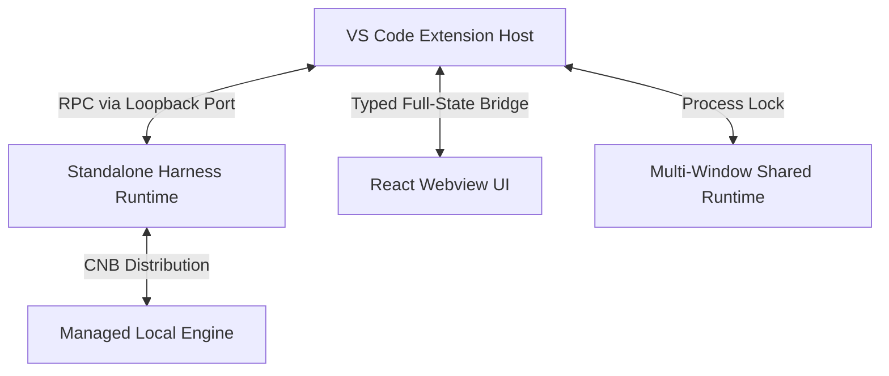

<p align="center">
  
</p>

<h1 align="center">DSH VSCode Integration</h1>

<p align="center">
  DSH VSCode集成插件。额外支持diff预览，余额实时查看，内建Trace分析！
</p>

<p align="center">
  <a href="README.md">English</a> | <strong>简体中文</strong>
</p>

<p align="center">
  <a href="https://open-vsx.org/extension/harcochen/dsh-vsc-integration"></a>
  <a href="https://marketplace.visualstudio.com/items?itemName=HarcoChen.dsh-vsc-integration"></a>
  <a href="https://github.com/HarcoChen/dsh-vsc-integration/stargazers"></a>
  <a href="https://github.com/HarcoChen/dsh-vsc-integration/blob/main/LICENSE"></a>
</p>

<p align="center">
  <em>独立社区项目，欢迎提 <a href="https://github.com/HarcoChen/dsh-vsc-integration/issues">issue</a>。</em>
</p>

<p align="center">
  JetBrains IDE（IDEA、PyCharm 等）版本请见 <a href="https://github.com/HarcoChen/dsh-intellij-integration">dsh-intellij-integration</a>。
</p>

<p align="center">
  
</p>

## 快速开始

1. **安装扩展**：从 [VS Code Marketplace](https://marketplace.visualstudio.com/items?itemName=HarcoChen.dsh-vsc-integration) 安装，或在扩展面板搜索 `DSH`。
2. **选工作区，开始对话**：设置好工作区，根据提示配置，直接提问即可。

## 核心功能

### 逐次编辑皆有原生 Diff，无需 Git

`write` / `edit` 类工具调用完成后，打开目标文件即可查看 VS Code 原生并排 Diff。底层通过 Session 日志倒放 Hunks 重建历史，即使在非 Git 仓库或被 Git ignore 的文件中也能正常工作。


### 批准前预览

审批卡片会展示真实的命令行、工作目录以及写入的目标文件，点击允许之前可以完整检查每一次改动。

### 斜杠命令

斜杠菜单会动态拉取当前会话 Runtime 注册的命令（`/plan`、`/compact`、`/goal` 等），并与扩展自有的 IDE 命令合并展示。


### 编辑器与 Git 上下文

- 右键菜单直接对当前文件、选区或 Git Diff 执行解释、修复、评审或文档生成。
- 资源管理器中右键 `Ask about resource` 即可提问。
- `@` 菜单补全工作区文件及历史 Session。
- `DSH: Capture AppShot`（仅 macOS）捕获窗口截图并作为草稿插入对话。

### 会话、Trace 与活动面板

侧栏提供原生对话大纲树视图；Trace、Token 用量、Todo 清单与子代理统一归集在活动面板。UI 适配 VS Code 深浅主题。


### 凭据与余额

底部快速查看当前余额，支持峰谷定价显示，支持低余额采用醒目颜色警示。


## 架构与运行机制

多个 VS Code 窗口优先复用同一个本地 Harness Runtime。扩展启动的 Runtime 通过进程锁公布其随机 loopback 端口，后续窗口直接连接，避免多写冲突。



## 配置

完整列表可在 VS Code 设置界面搜索 `dsh`。

| 设置项 | 默认值 | 说明 |
| --- | --- | --- |
| `dsh.serverUrl` | `""` | 已运行的 dsh web Runtime 地址，设置后扩展将直接连接。 |
| `dsh.autoStart` | `true` | 扩展激活时自动启动或连接 dsh web。 |
| `dsh.installWhenMissing` | `true` | 若无可用的 npm/dsh 环境，自动下载并托管独立 Runtime。 |
| `dsh.runtimeVersion` | `0.1.2-rc.1` | 托管 Runtime 的锁定版本。 |
| `dsh.npmRegistry` | `https://registry.npmmirror.com` | 下载后备重试的 Registry 镜像。 |
| `dsh.npxTimeoutMs` | `120000` | 等待包管理器下载与启动的超时时间。 |
| `dsh.maxContextBytes` | `120000` | 单次请求中 `<ide_context>` 的最大 UTF-8 字节数。 |
| `dsh.persistSession` | `true` | 尽可能复用当前工作区上次的 Session ID。 |
| `dsh.agentStatusLabels` | *!?大肥鱼?1* | 每轮流式输出随机展示的文本提示，支持自定义。 |
| `dsh.agentStatusLabel` | `""` | 设置后将固定显示该提示文案。 |
| `dsh.enableEffortKnob` | `true` | 推理强度滑块使用跑步 sprite 动画作为按钮。 |

## 其他安装方式

**从 GitHub Releases 安装**：下载 [Releases](https://github.com/HarcoChen/dsh-vsc-integration/releases) 里的 `.vsix`，运行 `Extensions: Install from VSIX...`。预发布版本仅发布到 GitHub Releases。

**从源码构建**：

```bash
npm install
npm run check
npm run package
```

随后通过 `Extensions: Install from VSIX...` 安装生成的 `.vsix`。

## 扩展 API

其他 VS Code 扩展可以接入 DSH 导出的 API。

<details>
<summary><strong>对话导航 API</strong>：注册自定义节点</summary>

```ts
const registration = api.registerConversationNavigation([
    { seq: 42, label: "检查 PPO 实现", detail: "训练配置" },
]);
context.subscriptions.push(registration);
```

</details>

<details>
<summary><strong>Agent Status Label API</strong>：自定义流式状态文案</summary>

```ts
const dsh = vscode.extensions.getExtension<import("dsh-vsc-integration").DshExtensionApi>(
    "harcochen.dsh-vsc-integration",
);
const api = await dsh?.activate();
context.subscriptions.push(
    api?.registerAgentStatusPresentation({ label: "🐋 深潜中" }),
);
```

</details>

## 开发与测试

```bash
npm install
npm run check      # TypeScript 检查（宿主 + webview）
npm test           # 发布门槛：webview 检查 + 编译 + 测试套件
npm run compile    # 构建到 dist/
npm run package    # 编译 + vsce 打包
npm run release    # 测试 + 版本提升 + CHANGELOG 归档 + 打 tag
```

验证托管 Runtime 的发布逻辑：

```bash
node scripts/verify-managed-runtime.mjs              # 仅校验远端契约
node scripts/verify-managed-runtime.mjs --full       # 安装并冒烟测试
```

## 更多信息

- [更新日志](CHANGELOG.md)
- [产品 TODO](TODO.md)
- [第三方资产说明](THIRD_PARTY_NOTICES.md)

## 致谢

感谢 [dsh-reasoning-effort](https://github.com/HanaAyane/dsh-reasoning-effort) 提供推理强度控件的跑步 sprite 参考。对话大纲受 `dsh-milestone` 项目启发。

## 许可证

[MIT](LICENSE)
