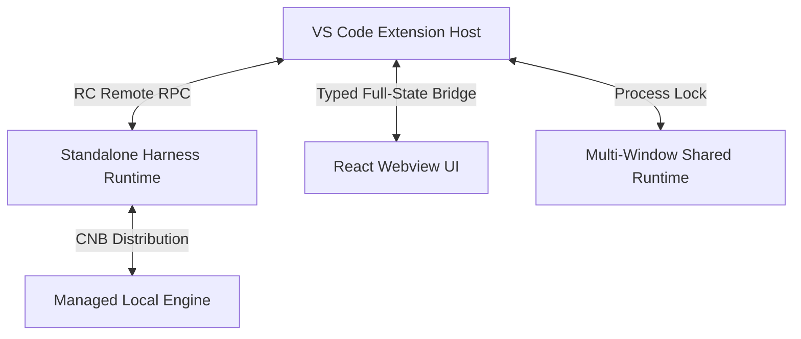

<p align="center">
  
</p>

<h1 align="center">DeepSeek Harness for VS Code</h1>

<p align="center">
  将 DeepSeek Harness（DSH）带进 VS Code：结合IDE的上下文完成任务，查看原生Diff，通过 Trace 和用量面板了解Agent的执行过程。
</p>

<p align="center">
  <a href="README.md">English</a> | <strong>简体中文</strong>
</p>

<p align="center">
  <a href="https://open-vsx.org/extension/harcochen/dsh-vsc-integration"></a>
  <a href="https://marketplace.visualstudio.com/items?itemName=HarcoChen.dsh-vsc-integration"></a>
  <a href="https://github.com/HarcoChen/dsh-vsc-integration/stargazers"></a>
  <a href="https://github.com/HarcoChen/dsh-vsc-integration/blob/main/LICENSE"></a>
</p>

<p align="center">
  <a href="https://marketplace.visualstudio.com/items?itemName=HarcoChen.dsh-vsc-integration"><strong>安装到 VS Code</strong></a> ·
  <a href="https://open-vsx.org/extension/harcochen/dsh-vsc-integration">Open VSX</a> ·
  <a href="https://github.com/HarcoChen/dsh-vsc-integration/releases">下载 VSIX</a> ·
  <a href="CHANGELOG.md">更新日志</a>
</p>

<p align="center">
  <em>独立社区项目，欢迎提 <a href="https://github.com/HarcoChen/dsh-vsc-integration/issues">issue</a>。</em>
</p>

<p align="center">
  JetBrains IDE（IDEA、PyCharm 等）版本请见 <a href="https://github.com/HarcoChen/dsh-intellij-integration">dsh-intellij-integration</a>。
</p>

<p align="center">
  
</p>

## 为什么选择 DSH？

- **看清代码改动**：在 VS Code 原生并排 Diff 中审查工具编辑，非 Git 仓库也能使用。
- **在执行前做决定**：审批卡展示命令与目标文件，受支持的文件写入可预览拟议改动。
- **带着上下文开始任务**：引用文件、选区、Git Diff 或暂停时的调试状态，减少来回复制粘贴。
- **随时接着做**：恢复持久会话，在活动面板查看工具执行、子代理、Todo 与 Token 用量。

## 快速开始

需要 **VS Code 1.106.0 或更高版本**，以及已配置的 DSH 模型服务与凭据。

1. **安装扩展**：选择上方 Marketplace 或 Open VSX 入口，也可以在扩展面板搜索 `harcochen.dsh-vsc-integration`。
2. **打开聊天**：打开项目文件夹并确认信任，在命令面板运行 `DSH: 打开聊天`（`DSH: Open Chat`）。扩展会自动启动或连接 Runtime；缺少可用环境时，默认尝试下载托管 Runtime。
3. **完成首次配置**：通过 `DSH: 配置 API Key`（`DSH: Configure API Key`）设置 DeepSeek 凭据。其他 Provider 可在 `DSH: 在浏览器中打开 dsh Web UI` 中配置。选择或注册 DSH Workspace，再选择模型。
4. **开始一个任务**：输入 `@` 引用文件，或右键选区选择 DSH 操作。查看执行过程，在需要审批时确认操作，并通过工具卡打开 Diff 审查结果。

### 从这些任务开始

| 你想做什么 | 可以这样开始 |
| --- | --- |
| 读懂一段代码 | 选中代码并右键使用 DSH 解释：“说明这段代码的执行流程和边界条件。” |
| 审查改动 | 对 Git Diff 使用 DSH 评审：“检查这些改动是否引入回归，并标出相关位置。” |
| 排查断点 | 调试暂停时运行 `DSH: Explain Current Debug State`，附加调用栈和局部变量等上下文。 |
| 继续之前的工作 | 切换到历史会话，通过对话大纲定位之前的讨论。 |

## 核心功能

### 逐次编辑皆有原生 Diff，无需 Git

`write` / `edit` 类工具调用完成后，打开目标文件即可查看 VS Code 原生并排 Diff。底层通过 Session 日志倒放 Hunks 重建历史，即使在非 Git 仓库或被 Git ignore 的文件中也能正常工作。


### 批准前预览

审批卡片会展示真实的命令行、工作目录以及写入的目标文件，对于受支持的文件写入工具，还可以在批准前打开原生 Diff，检查拟议改动。

### 斜杠命令

斜杠菜单会动态拉取当前会话 Runtime 注册的命令（`/plan`、`/compact`、`/goal` 等），并与扩展自有的 IDE 命令合并展示。


### 编辑器与 Git 上下文

- 右键菜单直接对当前文件、选区或 Git Diff 执行解释、修复、评审或文档生成。
- 资源管理器中右键 `Ask about resource` 即可提问。
- `@` 菜单补全项目文件及历史 Session。
- `DSH: Capture AppShot`（仅 macOS）捕获窗口截图并作为草稿插入对话。

### 会话、Trace 与活动面板

侧栏提供原生对话大纲树视图；Trace、Token 用量、Todo 清单与子代理统一归集在活动面板。UI 适配 VS Code 深浅主题。


### 凭据与余额

底部快速查看当前余额，支持峰谷定价显示，支持低余额采用醒目颜色警示。


## 常见问题

**需要手动安装 DSH 吗？** 通常不需要。扩展会寻找可用的本地环境，并在需要时尝试下载托管 Runtime。首次下载需要联网；`dsh.installWhenMissing` 可控制自动安装。

**可以连接已有 Runtime 吗？** 可以，将 `dsh.serverUrl` 设置为正在运行的 `dsh web` 地址；如果地址中没有 Token，再将启动 Token 填入 `dsh.serverToken`。本扩展兼容 `dsh 0.1.5-rc.1` 和 `0.1.5-rc.2`，包含 V3 历史和显式订阅的 Assistant 流；默认下载及升级目标仍是 RC.1，其他版本需另行审计。会话迁移保留原始日志，但旧 Runtime 无法读取迁移后的 V3 文件。

源码审计覆盖上游 master `c291e7961a` 和发布标签 `dsh-v0.1.5-rc.2`（`fb2c4b9e698e30edb738bca4cf0618587db7d203`）。消息反馈保留正负评价的分类，包括编辑及版本冲突返回值。Runtime 提供 master 新增的可选 `modeSelectionEnabled` 策略时，关闭开关会隐藏 IDE 模式选项、清除暂存模式，并在空会话首次发送前恢复有效默认模式；已开始的会话保留原有组合。Skill 补全悬浮提示展示 Runtime 提供的 `SKILL.md` 路径；缺少可选字段时保留 RC.2 行为。这不代表自动接受任意源码构建版本。

本次检查时，npm 的 `latest` 仍指向 RC.1，RC.2 发布在 `next` 标签；扩展默认仍请求 `0.1.5-rc.1`，本机已有兼容的 RC.2 时直接复用，不降级。

默认 `dsh.command: "auto"` 依次探测 PATH 和 npm 全局目录中的 `dsh --version`。本机 CLI 兼容就直接调用；不兼容则先提示当前版本、目标版本和安装位置，用户同意后才将已确认的旧版 npm 全局安装升级到 `dsh.runtimeVersion`，随后重新探测同一 CLI。用户拒绝或关闭提示后，才依次回退固定版本的 pnpm、npx、CNB 托管 Runtime；没有本机 CLI 时也走这条回退路径。升级失败可选择回退或取消启动。版本未知、较新或不属于当前 npm 全局目录的安装只提供手动升级指引。诊断命令只读，不提示或执行升级。显式本机路径遵循相同升级流程，显式 pnpm/npx 保留包管理器启动。若之前保存了 `dsh.command: "pnpm"`，需重置或改为 `auto` 才会启用本机优先。

默认应用参数为 `web --no-open`，没有保存参数覆盖时会自动为 pnpm/npx 补齐启动前缀。已有包管理器参数配置保留，auto 选中本机 CLI 时移除包管理器及包名前缀。共享 Runtime 的发现及锁迁移仍先于新启动器选择，回退不会绕过占用中的锁。

本次适配检查时，CNB 独立 Runtime 镜像的 `0.1.5-rc.2` 仍返回 404；镜像发布前可使用兼容的本机 CLI、固定版本的 pnpm/npx 回退或已有实例，独立 Runtime 下载路径尚未验证通过。编译后可执行 `node scripts/verify-runtime-discovery.mjs`，在隔离 POSIX CLI 环境中验证选择及实际启动参数，不下载包、不请求模型。

**支持多根工作区吗？** DSH 支持多个彼此独立的 Workspace，但每个 Session 只有一个工作目录（`cwd`）。VS Code 多根工作区启动 Runtime 时使用第一个 workspace folder；如果不同根目录需要不同工作目录，请分别建立 DSH Workspace 或 Session。

**会自动识别密钥或个人信息吗？** 不会。上下文目前只根据用户主动选择的文件、选区和附件计算大小与截断；不会把文件内容交给额外的秘密/个人信息分类器。

**启动失败怎么办？** 在命令面板运行 `DSH: Diagnose Environment` 查看诊断，再用 `DSH: Show dsh Runtime Logs` 查看日志。提交 [issue](https://github.com/HarcoChen/dsh-vsc-integration/issues) 时请附上扩展版本、操作系统和脱敏后的错误信息。

**支持中文吗？** 支持。命令、聊天、活动面板和 Trace 界面会跟随 VS Code 显示语言，提供英文与简体中文。

## 架构与运行机制

扩展通过 RC Remote RPC 连接 Runtime，使用 HTTP 调用和多路复用 WebSocket 获取实时会话更新。

多个 VS Code 窗口优先复用同一个本地 Harness Runtime。扩展启动的 Runtime 通过进程锁公布其随机 loopback 端口，后续窗口直接连接，避免多写冲突。

共享锁仍叫 `dsh-runtime.lock`，位于系统临时目录。内容记录 `runtimeVersion`、所有者 `pid` / `ownerId` / `createdAt`、启动进程 `runtimePid` / `runtimeProcess`、本实例的 POSIX `runtimeProcessGroup` 和连接地址。版本来自固定 npm 包规格、托管版本或本地启动器的 `--version`，不会把未知启动器标记成本扩展的默认版本。自动复用仅接受已审计的 RC.1/RC.2，保留实际探测的版本；无版本或版本不匹配的存活实例进入下述迁移流程，没有版本锁记录的自动端口发现仍被拒绝。手动指定 `dsh.serverUrl` 仍由使用者保证 Runtime 版本。

锁清理规则：

- 正常停用扩展会返回可等待的清理 Promise。停止/销毁可重复调用，并取消正在进行的启动；先停止本实例的进程树，再释放锁。POSIX 使用独立进程组，先 TERM、必要时限时 KILL；Windows 在根进程身份仍可确认时使用限定 PID 的 `taskkill /T`。释放同时核对 `ownerId`、文件身份及内容，保留其他所有者替换后的锁。强制退出编辑器仍可能留下残留锁。
- 自动回收要求编辑器以及已记录的启动进程/进程组退出，曾公布的数字回环地址端口明确拒绝 TCP 连接。无版本旧锁只要原编辑器已退出、原端口已关闭，也能自动迁移，不会仅因缺少版本字段卡住升级。HTTP 错误、权限不足或超时不算退出证据。
- 对仍在运行、能确认 DSH npm 入口身份的孤儿进程，提供“停止旧 Runtime 并升级”。仅在明确确认后，再次核对锁、原编辑器、监听 PID、启动时间及命令行，才发送 SIGTERM。这会中断任务，也可能影响其他已连接的编辑器；磁盘会话保留，未保存的实时输出可能丢失。取消则保留进程及锁；手动停止旧实例后可执行 DSH 重启命令重试。
- 原编辑器仍存活、进程身份或端点不明、锁损坏/半写入时保留锁并提示人工处理。没有地址的旧包装启动器仍不能确认失效；新启动的所属进程组即使尚未公布地址也能核实退出，允许下载失败后的安全重试。无法证明进程树已停止时仍保留锁，包括根进程已提前退出的 Windows 包装启动器。
- 创建、写入和删除通过短暂的 `dsh-runtime.lock.mutation` 互斥文件串行化，防止两个窗口同时回收旧锁。若进程恰在修改锁期间崩溃，该保护文件不会被猜测性删除；错误信息会给出路径，确认其所有者已退出后再手动清理。不要在 Runtime 正在运行时手动删锁。

运行 `npm run compile` 后，分别执行 `node scripts/verify-runtime-lock.mjs`、`node scripts/verify-runtime-migration.mjs`、`node scripts/verify-runtime-shutdown.mjs`，验证锁、升级确认及退出清理；脚本仅使用隔离临时目录、子进程及回环监听器。



## 配置

完整列表可在 VS Code 设置界面搜索 `dsh`。

| 设置项 | 默认值 | 说明 |
| --- | --- | --- |
| `dsh.serverUrl` | `""` | 已运行的 dsh web Runtime 地址，设置后扩展将直接连接；可在地址中附加 `?token=...`，或单独设置 `dsh.serverToken`。 |
| `dsh.serverToken` | `""` | `dsh.serverUrl` 对应的启动 Token；地址与 Token 分开配置时填写。 |
| `dsh.autoStart` | `true` | 扩展激活时自动启动或连接 dsh web。 |
| `dsh.installWhenMissing` | `true` | 若无可用的 npm/dsh 环境，自动下载并托管独立 Runtime。 |
| `dsh.runtimeVersion` | `0.1.5-rc.1` | 用户同意后的 CLI 升级及插件下载目标，支持已审计的 RC.1/RC.2；CNB 下载需镜像已发布。 |
| `dsh.npmRegistry` | `https://registry.npmmirror.com` | 下载后备重试的 Registry 镜像。 |
| `dsh.npxTimeoutMs` | `120000` | 等待包管理器下载与启动的超时时间。 |
| `dsh.maxContextBytes` | `120000` | 单次请求中 `<ide_context>` 的最大 UTF-8 字节数。 |
| `dsh.persistSession` | `true` | 尽可能复用当前工作区上次的 Session ID。 |
| `dsh.agentStatusLabels` | *内置“大肥鱼”状态文案* | 每轮流式输出随机展示的文本提示，支持自定义。 |
| `dsh.agentStatusLabel` | `""` | 设置后将固定显示该提示文案。 |
| `dsh.enableEffortKnob` | `true` | 推理强度滑块使用跑步 sprite 动画作为按钮。 |

## 其他安装方式

**从 GitHub Releases 安装**：下载 [Releases](https://github.com/HarcoChen/dsh-vsc-integration/releases) 里的 `.vsix`，运行 `Extensions: Install from VSIX...`。预发布版本会带 pre-release 标记发到 Open VSX，同时挂在 GitHub Releases：在 Open VSX 上只有把该扩展切换到预发布版本的用户才会收到；它们不会进 VS Code Marketplace，那边不接受带 SemVer 预发布后缀的版本号。`0.8.0` 起正式版使用偶数 minor（`0.8.x`）、预发布使用更高的奇数 minor（`0.9.x`），因此正式版不会盖过更新的预发布版本。

**从源码构建**：

```bash
npm install
npm run check
npm run package
```

随后通过 `Extensions: Install from VSIX...` 安装生成的 `.vsix`。

## 扩展 API

其他 VS Code 扩展可以接入 DSH 导出的 API。

<details>
<summary><strong>对话导航 API</strong>：注册自定义节点</summary>

```ts
const registration = api.registerConversationNavigation([
    { seq: 42, label: "检查 PPO 实现", detail: "训练配置" },
]);
context.subscriptions.push(registration);
```

</details>

<details>
<summary><strong>Agent Status Label API</strong>：自定义流式状态文案</summary>

```ts
const dsh = vscode.extensions.getExtension<import("dsh-vsc-integration").DshExtensionApi>(
    "harcochen.dsh-vsc-integration",
);
const api = await dsh?.activate();
context.subscriptions.push(
    api?.registerAgentStatusPresentation({ label: "🐋 深潜中" }),
);
```

</details>

## 开发与测试

```bash
npm install
npm run check      # TypeScript 检查（宿主 + webview）
npm test           # 发布门槛：webview 检查 + 编译 + 测试套件
npm run compile    # 构建到 dist/
npm run package    # 编译 + vsce 打包
npm run release    # 测试 + 版本提升 + CHANGELOG 归档 + 打 tag
```

用已安装的 `0.1.5-rc.2` 启动器验证 Remote 集成：

```bash
npm run compile
node scripts/verify-remote-runtime.mjs --launcher /absolute/path/to/dsh
```

脚本使用临时 DSH_HOME、工作目录和回环地址上的模拟模型，不使用现有 Session 或外部模型凭据。验证脚本要求 Node.js >=22.15.0，且 `node:zlib` 支持 Zstandard（`zstdCompressSync`；Node 23 用户需 >=23.8.0）。

验证托管 Runtime 的发布逻辑：

```bash
node scripts/verify-managed-runtime.mjs              # 仅校验远端契约
node scripts/verify-managed-runtime.mjs --full       # 安装并冒烟测试
```

## 更多信息

- [更新日志](CHANGELOG.md)
- [产品 TODO](TODO.md)
- [第三方资产说明](THIRD_PARTY_NOTICES.md)

## 致谢

感谢 [dsh-reasoning-effort](https://github.com/HanaAyane/dsh-reasoning-effort) 提供推理强度控件的"大肥鱼跑步"参考。对话大纲受 `dsh-milestone` 项目启发。

## 许可证

[MIT](LICENSE)
