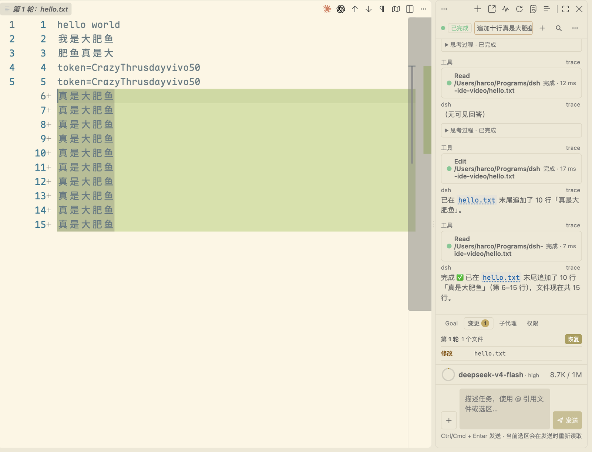
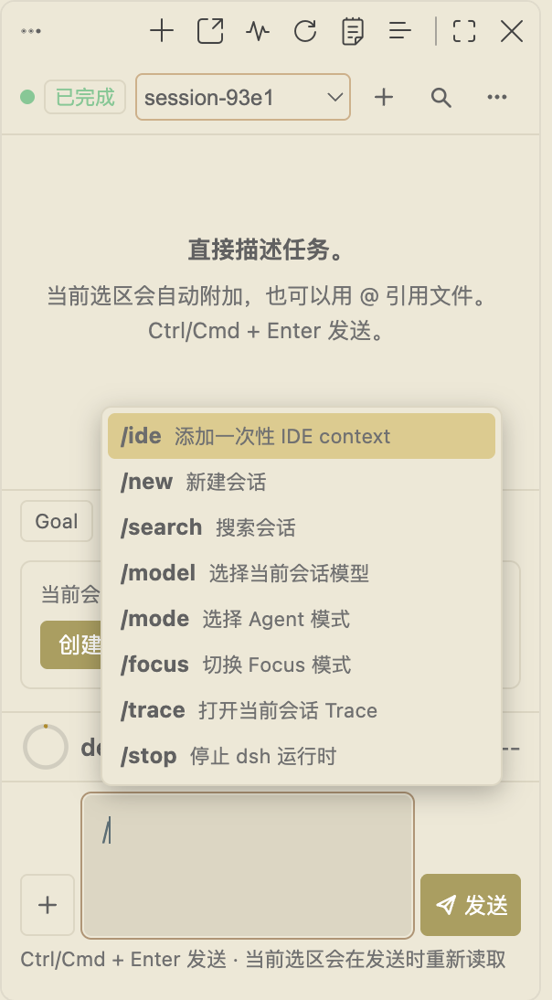
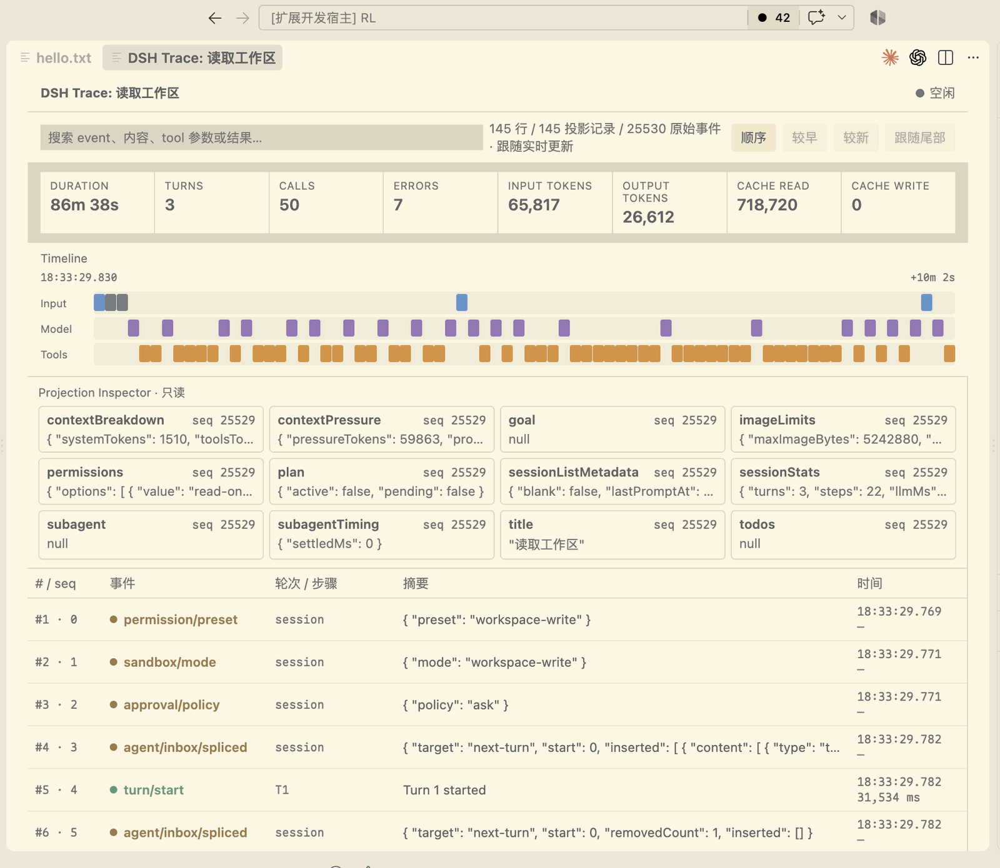
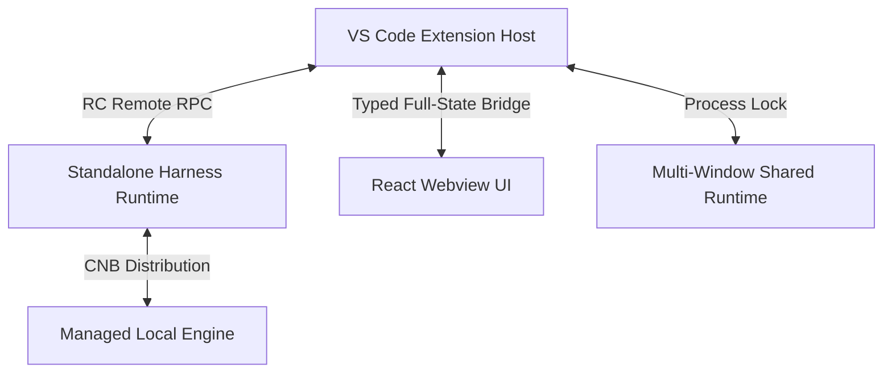

<p align="center">
  
</p>

<h1 align="center">DeepSeek Harness for VS Code</h1>

<p align="center">
  将 DeepSeek Harness（DSH）带进 VS Code：结合IDE的上下文完成任务，查看原生Diff，通过 Trace 和用量面板了解Agent的执行过程。
</p>

<p align="center">
  <a href="README.md">English</a> | <strong>简体中文</strong>
</p>

<p align="center">
  <a href="https://open-vsx.org/extension/harcochen/dsh-vsc-integration"></a>
  <a href="https://marketplace.visualstudio.com/items?itemName=HarcoChen.dsh-vsc-integration"></a>
  <a href="https://github.com/HarcoChen/dsh-vsc-integration/stargazers"></a>
  
  
  <a href="https://github.com/HarcoChen/dsh-vsc-integration/blob/main/LICENSE"></a>
</p>

<p align="center">
  <a href="https://marketplace.visualstudio.com/items?itemName=HarcoChen.dsh-vsc-integration"><strong>安装到 VS Code</strong></a> ·
  <a href="https://open-vsx.org/extension/harcochen/dsh-vsc-integration">Open VSX</a> ·
  <a href="https://github.com/HarcoChen/dsh-vsc-integration/releases">下载 VSIX</a> ·
  <a href="CHANGELOG.md">更新日志</a>
</p>

<p align="center">
  <em>独立社区项目，欢迎提 <a href="https://github.com/HarcoChen/dsh-vsc-integration/issues">issue</a>。</em>
</p>

<p align="center">
  JetBrains IDE版本请见 <a href="https://github.com/HarcoChen/dsh-intellij-integration">dsh-intellij-integration</a>。
</p>

<p align="center">
  
</p>


## 为什么选择 DSH？

- **看清代码改动**：在 VS Code 原生并排 Diff 中审查工具编辑，非 Git 仓库也能使用。
- **在执行前做决定**：审批卡展示命令与目标文件，受支持的文件写入可预览拟议改动。
- **带着上下文开始任务**：引用文件、选区、Git Diff 或暂停时的调试状态，减少来回复制粘贴。
- **随时接着做**：恢复持久会话，在活动面板查看工具执行、子代理、Todo 与 Token 用量。
- **更聪明的 Agent 决策，无需额外安装**：打开内置的 Laya/Jev 集成，发现循环、精简冗长输出，并用证据核对“已完成”的说法。

## 快速开始

需要 **VS Code 1.106.0 或更高版本**，以及已配置的 DSH 模型服务与凭据。

1. **安装扩展**：选择上方 Marketplace 或 Open VSX 入口，也可以在扩展面板搜索 `harcochen.dsh-vsc-integration`。
2. **打开聊天**：打开项目文件夹并确认信任，在命令面板运行 `DSH: 打开聊天`（`DSH: Open Chat`）。扩展会自动启动或连接 Runtime；缺少可用环境时，默认尝试下载托管 Runtime。
3. **完成首次配置**：通过 `DSH: 配置 API Key`（`DSH: Configure API Key`）设置 DeepSeek 凭据。其他 Provider 可在 `DSH: 在浏览器中打开 dsh Web UI` 中配置。选择或注册 DSH Workspace，再选择模型。
4. **开始一个任务**：输入 `@` 引用文件，或右键选区选择 DSH 操作。查看执行过程，在需要审批时确认操作，并通过工具卡打开 Diff 审查结果。
5. **（可选）启用 Laya/Jev**：打开 `dsh.jev.enabled` 及需要的功能开关，运行 `DSH: 配置 Jev API Key`，按提示重启 Runtime。详见 [内置 Laya / Jev System One 决策](#内置-laya--jev-system-one-决策)。

### 从这些任务开始

| 你想做什么 | 可以这样开始 |
| --- | --- |
| 读懂一段代码 | 选中代码并右键使用 DSH 解释：“说明这段代码的执行流程和边界条件。” |
| 审查改动 | 对 Git Diff 使用 DSH 评审：“检查这些改动是否引入回归，并标出相关位置。” |
| 排查断点 | 调试暂停时运行 `DSH: Explain Current Debug State`，附加调用栈和局部变量等上下文。 |
| 继续之前的工作 | 切换到历史会话，通过对话大纲定位之前的讨论。 |

## 核心功能

### 逐次编辑皆有原生 Diff，无需 Git

`write` / `edit` 类工具调用完成后，打开目标文件即可查看 VS Code 原生并排 Diff。底层通过 Session 日志倒放 Hunks 重建历史，即使在非 Git 仓库或被 Git ignore 的文件中也能正常工作。



### 批准前预览

审批卡片会展示真实的命令行、工作目录以及写入的目标文件，对于受支持的文件写入工具，还可以在批准前打开原生 Diff，检查拟议改动。

若目标文件在编辑器中仍有未保存改动，审批不会被放行：卡片会列出这些文件并保持待处理，保存或还原后即可重新批准。

### 内置 Laya / Jev System One 决策

[Jev](https://typesafe.ai/blog/introducing-system-one-models-and-jev) 是 TypeSafe 推出的 System One 决策模型。它不生成文本，而是读取 Agent 状态，在毫秒级返回经过校准的结构化答案。[Laya](https://huggingface.co/convaiinnovations/laya) 是 Apache-2.0 协议的开源权重替代品，提供相同的 `POST /v1/systemone` 请求与响应格式。扩展随包携带 [`dsh-jev-integration`](https://github.com/HarcoChen/dsh-jev-integration) Runtime 插件（与 JetBrains 版共用），并挂载到它启动的每个 Runtime 上。不需要另装插件，也不需要改 DSH profile。

| 功能 | 设置 | 作用 |
| --- | --- | --- |
| 循环保护 | `dsh.jev.loopGuard.enabled` | 工具执行后识别语义上的死循环，引导 Agent 跳出。 |
| 结果整形 | `dsh.jev.resultShaper.enabled` | 对重复的大段工具输出分类折叠，保留警告与失败信息。 |
| 完成检查 | `dsh.jev.doneGate.enabled` | 用工具证据核对“已完成”的说法，必要时追加一轮验证。 |
| 工具裁剪 | `dsh.jev.toolPruner.enabled` | 对模型可见的工具 schema 排序，不改变 DSH 权限和工具注册。 |
| Skill 路由 | `dsh.jev.skillRouter.enabled` | 挑选相关 skill，并在上下文中加入有长度上限的建议。 |
| 决策工具 | `dsh.jev.decisionTools.enabled` | 向 Agent 暴露 `jev_ask`、`jev_rank`、`jev_check` 工具。 |
| 确定性安全检查 | `dsh.jev.deterministicSafetyGuard.enabled` | 在本地检查破坏性命令、提权和凭据泄露，检查数据不出本机。 |

**使用 Jev**：打开 `dsh.jev.enabled` 及需要的功能，运行 `DSH: 配置 Jev API Key`，按提示重启 Runtime。Key 加密保存在 VS Code SecretStorage。

**使用 Laya**：将 `dsh.jev.baseUrl` 指向提供 Laya System One 接口的 HTTPS 地址，`dsh.jev.model` 设为该服务要求的模型名，并配置 API Key；服务端不校验 Key 时填任意占位值即可。扩展只接受 `https://` 地址，其他地址会回退到 TypeSafe 默认端点。

所有功能默认关闭。启用后，相关功能可能把所需样本发送到配置的端点。已有或外部托管的 Runtime 不会被修改。

### 会话、账号与定时提醒（dsh 0.1.7-rc.2）

- `DSH: 管理会话` 可置顶会话、恢复已归档会话；`DSH: 归档会话` 遇到仍在运行的任务时，会先询问是否停止。没有打开 VS Code 文件夹时也能使用 DSH Workspace。
- `DSH: 管理 DeepSeek 账号` 支持浏览器登录、登出，并查看账号资料和余额。
- 定时提醒面板跨会话列出提醒，可编辑每日、每周或 cron 规则，查看投递历史，删除提醒。

### 斜杠命令

斜杠菜单会动态拉取当前会话 Runtime 注册的命令（`/plan`、`/compact`、`/goal` 等），并与扩展自有的 IDE 命令合并展示。



### 编辑器与 Git 上下文

- 右键菜单直接对当前文件、选区或 Git Diff 执行解释、修复、评审或文档生成。
- 资源管理器中右键 `Ask about resource` 即可提问。
- `@` 菜单补全项目文件及历史 Session。
- `DSH: Capture AppShot`（仅 macOS）捕获窗口截图并作为草稿插入对话。

### 会话、Trace 与活动面板

侧栏提供原生对话大纲树视图；Trace、Token 用量、Todo 清单与子代理统一归集在活动面板。UI 适配 VS Code 深浅主题。

运行 `DSH: 在编辑器标签页中打开聊天`（`DSH: Open Chat in Editor Tab`）可以把同一份对话镜像到编辑器标签页，让聊天紧挨着正在改的文件。两个界面共用一个会话与一条流，切换不会重开或分叉。



### 自主调试（默认关闭）

开启 `dsh.autonomousDebugging` 后，扩展会在本窗口内起一个只监听回环地址的 MCP 端点，Agent 由此操作 VS Code 调试器：`debug_start` 启动工作区里已有的 launch 配置，`debug_breakpoint` 增加、删除、列出断点，`debug_control` 继续、单步并等待下一次暂停，`debug_context` 读取暂停时的调用栈、变量与源码。名字疑似密钥的变量在离开窗口前会替换为 `[redacted by dsh-ide]`。端点仅绑定 `127.0.0.1`，校验 `Host` 头与每次启动单独的令牌，也不允许模型自造 launch 配置。该能力只对本窗口自行启动的 Runtime 生效；切换设置后需重启 Runtime，扩展会在设置变更时提示。

### 凭据与余额

底部快速查看当前余额，支持峰谷定价显示，支持低余额采用醒目颜色警示。


## 常见问题

**需要手动安装 DSH 吗？** 通常不需要。扩展会寻找可用的本地环境，并在需要时尝试下载托管 Runtime。首次下载需要联网；`dsh.installWhenMissing` 可控制自动安装。

**Laya/Jev 是怎么集成的？** 扩展安装包自带 IDE 无关的 `dsh-jev-integration` Runtime 包，并只挂载到本扩展自行启动的 Runtime；不会修改已有或外部托管的 Runtime。Laya 走同一套 System One 接口，修改 `dsh.jev.baseUrl` 即可（仅限 HTTPS）。Jev 默认关闭，`dsh.jev.enabled` 是总开关；循环保护、结果整形、完成证据检查、工具裁剪、skill 路由、决策工具和本地确定性安全检查分别提供开关。endpoint 和模型可配置，数值阈值使用内置默认值。API Key 通过 **DSH：配置 Jev API Key** 加密保存在 VS Code SecretStorage，也可从 `TYPESAFE_API_KEY` 或 `$HOME/.dsh/.env` 读取。启用的功能可能会将所需样本发送到 TypeSafe System One。设置变更需重启 Runtime。本版本提供 upstream `dsh-jev` 的共享 Runtime 子集，不包含完整 Agent Loop、Dashboard、浏览器或移动端 bundle。

**可以连接已有 Runtime 吗？** 可以，将 `dsh.serverUrl` 设置为正在运行的 `dsh web` 地址；如果地址中没有 Token，再将启动 Token 填入 `dsh.serverToken`。本扩展接受所有不低于 `dsh 0.1.5-rc.1` 的合法 SemVer，包括更新的预发布版本及正式版；默认下载及用户同意后的升级目标为 `0.1.7-rc.2`，本机已有兼容版本时直接复用，不降级。扩展通过公开 Remote 分页和 follow API 读取会话历史；日志存储格式及迁移由 Runtime 负责。

Remote 源码审计目标为上游 tag `dsh-v0.1.7-rc.2`（`477b4f420553e8a52c2fbccc464d7561b239c443`），详见 [RPC 适配报告](./RPC_0.1.7_ADAPTATION.md)。Carrier 支持 multipart 二进制 unary 响应和 Client 到 Host 的流帧。归档有活动任务的会话前，界面会先询问是否停止任务；Agent Preset 管理遵循当前只读 roster 契约。报告也记录了尚未接入 IDE 的 Jobs、插件、权限预设和终端接口。

默认 `dsh.command: "auto"` 依次探测 PATH 和 npm 全局目录中的 `dsh --version`。本机 CLI 兼容就直接调用；不兼容则先提示当前版本、目标版本和安装位置，用户同意后才将已确认的旧版 npm 全局安装升级到 `dsh.runtimeVersion`，随后重新探测同一 CLI。用户拒绝或关闭提示后，才依次回退固定版本的 pnpm、npx、CNB 托管 Runtime；没有本机 CLI 时也走这条回退路径。升级失败可选择回退或取消启动。版本未知或不属于当前 npm 全局目录的旧安装只提供手动升级指引。诊断命令只读，不提示或执行升级。显式本机路径遵循相同升级流程，显式 pnpm/npx 保留包管理器启动。若之前保存了 `dsh.command: "pnpm"`，需重置或改为 `auto` 才会启用本机优先。

默认应用参数为 `web --no-open`，没有保存参数覆盖时会自动为 pnpm/npx 补齐启动前缀。已有包管理器参数配置保留，auto 选中本机 CLI 时移除包管理器及包名前缀。共享 Runtime 的发现仍先于新启动器选择，回退会复用健康的 Runtime，而不是再起一个。

如果配置的下载源暂时没有独立 Runtime 资产，可使用兼容的本机 CLI、固定版本的 pnpm/npx 回退或已有实例。编译后可执行 `node scripts/verify-runtime-discovery.mjs`，在隔离 POSIX CLI 环境中验证选择及实际启动参数，不下载包、不请求模型。

**支持多根工作区吗？** DSH 支持多个彼此独立的 Workspace，但每个 Session 只有一个工作目录（`cwd`）。VS Code 多根工作区启动 Runtime 时使用第一个 workspace folder；如果不同根目录需要不同工作目录，请分别建立 DSH Workspace 或 Session。

**会自动识别密钥或个人信息吗？** 不会。上下文目前只根据用户主动选择的文件、选区和附件计算大小与截断；不会把文件内容交给额外的秘密/个人信息分类器。

**启动失败怎么办？** 在命令面板运行 `DSH: Diagnose Environment` 查看诊断，再用 `DSH: Show dsh Runtime Logs` 查看日志。提交 [issue](https://github.com/HarcoChen/dsh-vsc-integration/issues) 时请附上扩展版本、操作系统和脱敏后的错误信息。

**支持中文吗？** 支持。命令、聊天、活动面板和 Trace 界面会跟随 VS Code 显示语言，提供英文与简体中文。

## 架构与运行机制

扩展通过 RC Remote RPC 连接 Runtime，使用 HTTP 调用和多路复用 WebSocket 获取实时会话更新。

多个 VS Code 窗口通过 Runtime 广告互相发现，再回退到端口 `3080` 及配置的 `dsh.serverPort`。每个候选都先做健康检查：认证及 `session/list` 调用成功才算可用，广告中低于最低要求的版本直接排除。外部服务不会归本扩展所有，断开连接不会停止它。需要认证但缺少凭据时，会提示将 `dsh.serverUrl` 设为完整启动 URL（包含 token）。

广告只是发现用的元数据，任何字段都不授予也不否决启动权限。广告缺失、过期或无法读取都不会阻塞启动，最坏情况只是多做一次失败的健康探测，然后本窗口启动自己的 Runtime。

每个窗口只发布自己那一份 `<ownerId>.json`，位于系统临时目录下的 `dsh-runtime-advertisements-<user>`，记录端点、启动 URL、版本、PID 和 composition hash。窗口只写自己的文件，从不回收别人的；旧的 `dsh-runtime.lock` 仅作只读提示，不再写入或删除。读取时只取最近 16 条，被遗弃的文件挤不掉仍然存活的。

广告生命周期：

- 只有已就绪的端点才发布。在产生 URL 之前失败的启动不留下任何文件。
- 启动时通过回环 mutex 做短暂协调——最多等 250 ms、最多持有 500 ms——并在 spawn 前重新检查是否已有共享 Runtime。抢不到从不阻塞启动，只意味着本窗口起自己的 Runtime。
- 显式 stop、dispose 以及启动失败都会撤回广告。
- 启动器意外退出时放弃所有权，但只要端点仍然应答就保留广告——包管理器包装进程经常自己退出而它拉起的 Runtime 仍在服务。只有明确被拒绝的回环连接才撤回；超时或主机名有歧义时一律保留。
- 启动固定 `--host 127.0.0.1`；未设置 `dsh.serverPort` 时使用操作系统分配的端口。指定端口在 bind 竞争中失败时，会用操作系统分配的端口重试一次。
- 退出时先停止本扩展拥有的进程树，再撤回广告。POSIX 使用独立进程组，Windows 在根进程身份仍可确认时使用限定 PID 的 `taskkill /T`。

运行 `npm run compile` 后，分别执行 `node scripts/verify-runtime-discovery.mjs`、`node scripts/verify-runtime-shutdown.mjs`，验证启动器/端口选择、广告、升级确认及退出清理；脚本仅使用隔离临时目录、子进程及回环监听器。


```mermaid
graph TD
    A[VS Code Extension Host] <-->|RC Remote RPC| B[Standalone Harness Runtime]
    A <-->|Typed Full-State Bridge| C[React Webview UI]
    B <-->|CNB Distribution| D[Managed Local Engine]
    A <-->|Process Lock| E[Multi-Window Shared Runtime]
```

## 配置

完整列表可在 VS Code 设置界面搜索 `dsh`。

| 设置项 | 默认值 | 说明 |
| --- | --- | --- |
| `dsh.serverUrl` | `""` | 已运行的 dsh web Runtime 地址，设置后扩展将直接连接；可在地址中附加 `?token=...`，或单独设置 `dsh.serverToken`。 |
| `dsh.serverToken` | `""` | `dsh.serverUrl` 对应的启动 Token；地址与 Token 分开配置时填写。 |
| `dsh.autoStart` | `true` | 扩展激活时自动启动或连接 dsh web。 |
| `dsh.installWhenMissing` | `true` | 若无可用的 npm/dsh 环境，自动下载并托管独立 Runtime。 |
| `dsh.runtimeVersion` | `0.1.7-rc.2` | 用户同意后的 CLI 升级及插件下载目标，接受不低于 RC.1 的合法 SemVer。 |
| `dsh.npmRegistry` | `https://registry.npmmirror.com` | 下载后备重试的 Registry 镜像。 |
| `dsh.npxTimeoutMs` | `120000` | 等待包管理器下载与启动的超时时间。 |
| `dsh.enableCompaction` | `true` | 扩展自行启动 DSH Web server 时启用官方 `/compact` command。 |
| `dsh.jev.enabled` | `false` | 启用 Jev 总开关；受保护工具参数及已启用功能所需数据可能发送到 TypeSafe System One。请使用“DSH：配置 Jev API Key”配置密钥；修改后需重启 Runtime。 |
| `dsh.jev.baseUrl` | `https://api.typesafe.ai/v1/systemone` | Jev endpoint；远程地址请使用 HTTPS。 |
| `dsh.jev.model` | `jev-latest` | Jev 模型名。 |
| `dsh.jev.loopGuard.enabled` | `false` | 启用工具执行后的语义循环检测；轨迹样本可能发送给 Jev。 |
| `dsh.jev.resultShaper.enabled` | `false` | 启用大型工具结果重复文本的分类和整形；样本可能发送给 Jev。 |
| `dsh.jev.doneGate.enabled` | `false` | 让 Jev 根据工具证据检查完成声明。 |
| `dsh.jev.toolPruner.enabled` | `false` | 让 Jev 排序可见工具；不会改变 DSH 权限。 |
| `dsh.jev.skillRouter.enabled` | `false` | 让 Jev 选择相关 skill 并追加有界建议。 |
| `dsh.jev.decisionTools.enabled` | `false` | 暴露 Jev 提问/排序/检查工具；提交状态可能发送给 Jev。 |
| `dsh.jev.deterministicSafetyGuard.enabled` | `true` | 在本地检查危险命令和凭据泄漏。 |
| `dsh.autonomousDebugging` | `false` | 允许 Agent 通过本机回环 MCP 端点操作本窗口的调试器；只对本窗口自行启动的 Runtime 生效，切换后需重启 Runtime。 |
| `dsh.maxContextBytes` | `120000` | 单次请求中 `<ide_context>` 的最大 UTF-8 字节数。 |
| `dsh.persistSession` | `true` | 尽可能复用当前工作区上次的 Session ID。 |
| `dsh.agentStatusLabels` | *内置“大肥鱼”状态文案* | 每轮流式输出随机展示的文本提示，支持自定义。 |
| `dsh.agentStatusLabel` | `""` | 设置后将固定显示该提示文案。 |
| `dsh.enableEffortKnob` | `true` | 推理强度滑块使用跑步 sprite 动画作为按钮。 |

## 其他安装方式

**从 GitHub Releases 安装**：下载 [Releases](https://github.com/HarcoChen/dsh-vsc-integration/releases) 里的 `.vsix`，运行 `Extensions: Install from VSIX...`。预发布版本会带 pre-release 标记发到 Open VSX，同时挂在 GitHub Releases：在 Open VSX 上只有把该扩展切换到预发布版本的用户才会收到；它们不会进 VS Code Marketplace，那边不接受带 SemVer 预发布后缀的版本号。`0.8.0` 起正式版使用偶数 minor（`0.8.x`）、预发布使用更高的奇数 minor（`0.9.x`），因此正式版不会盖过更新的预发布版本。

**从源码构建**：

```bash
git submodule update --init --recursive
npm install
npm run check
npm run package
```

随后通过 `Extensions: Install from VSIX...` 安装生成的 `.vsix`。

## 扩展 API

其他 VS Code 扩展可以接入 DSH 导出的 API。

<details>
<summary><strong>对话导航 API</strong>：注册自定义节点</summary>

```ts
const registration = api.registerConversationNavigation([
    { seq: 42, label: "检查 PPO 实现", detail: "训练配置" },
]);
context.subscriptions.push(registration);
```

</details>

<details>
<summary><strong>Agent Status Label API</strong>：自定义流式状态文案</summary>

```ts
const dsh = vscode.extensions.getExtension<import("dsh-vsc-integration").DshExtensionApi>(
    "harcochen.dsh-vsc-integration",
);
const api = await dsh?.activate();
context.subscriptions.push(
    api?.registerAgentStatusPresentation({ label: "🐋 深潜中" }),
);
```

</details>

## 开发与测试

```bash
npm install
npm run check      # TypeScript 检查（宿主 + webview）
npm test           # 发布门槛：webview 检查 + 编译 + 测试套件
npm run compile    # 构建到 dist/
npm run package    # 编译 + vsce 打包
npm run release    # 测试 + 版本提升 + CHANGELOG 归档 + 打 tag
```

仓库中的 Remote 冒烟脚本使用历史 `0.1.5-rc.2` V3 fixture，不验证 `0.1.7-rc.1` 的 multipart、上行流或归档变更；当前适配边界见 [RPC 适配报告](./RPC_0.1.7_ADAPTATION.md)。

对兼容的本机启动器运行历史 Remote 冒烟：

```bash
npm run compile
node scripts/verify-remote-runtime.mjs --launcher /absolute/path/to/dsh
```

脚本使用临时 DSH_HOME、工作目录和回环地址上的模拟模型，不使用现有 Session 或外部模型凭据。验证脚本要求 Node.js >=22.15.0，且 `node:zlib` 支持 Zstandard（`zstdCompressSync`；Node 23 用户需 >=23.8.0）。

验证托管 Runtime 的发布逻辑：

```bash
node scripts/verify-managed-runtime.mjs              # 仅校验远端契约
node scripts/verify-managed-runtime.mjs --full       # 安装并冒烟测试
```

## 更多信息

- [更新日志](CHANGELOG.md)
- [产品 TODO](TODO.md)
- [第三方资产说明](THIRD_PARTY_NOTICES.md)

## 致谢

感谢 [dsh-reasoning-effort](https://github.com/HanaAyane/dsh-reasoning-effort) 提供推理强度控件的"大肥鱼跑步"参考。对话大纲受 `dsh-milestone` 项目启发。

## 许可证

[MIT](LICENSE)
