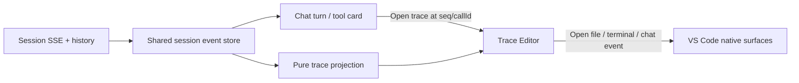

# DSH Session Trace 的 VS Code 集成设计

更新时间：2026-08-14。

## 结论

不要把 Harness Web UI iframe 到 VS Code，也不要把完整 Trace 塞进狭窄的右侧聊天栏。推荐采用三级渐进呈现：

1. **聊天内摘要**：每个 turn/assistant 底部只显示耗时、TTFT、token、tool 数和错误状态。
2. **定位入口**：点击摘要或工具卡片，打开并定位完整 Trace。
3. **Trace Editor Tab**：在编辑器区域提供时间轴、事件表和详情检查器，支持搜索、折叠、分页和深链接。

这会让 Trace 成为 DSH IDE 的可观察性中枢，而不是一个独立、重复的聊天页面。

## 为什么放在 Editor Tab

Harness Trajectory 同时需要横向时间轴、按 turn/step 分组的事件表和可调整宽度的详情面板。Secondary Sidebar 适合聊天，但不适合同时展示这些高密度信息。

使用 `WebviewPanel` 打开 `DSH Trace: <session title>`：

- 默认作为普通 Editor Tab 打开，可由用户拖到第二编辑器组。
- 注册 serializer，VS Code 重启后按 session ID 恢复，但不保留完整 webview 内存。
- 提供 `DSH: Open Session Trace` 和 `DSH: Open Session Trace to the Side`。
- 同一 session 只复用一个 Trace tab；再次打开时聚焦并跳到目标 seq/callId。
- tab 上用状态圆点表示 running、attention、failed，行为与多会话状态一致。

## 信息架构



Trace 与 Chat 必须消费同一份 session event store。Trace 不重新连接 runtime、不创建新 session，也不维护第二套业务状态。

## Trace Editor 布局

### 顶部 Overview

使用三条固定 lane：

- **Context**：system、user、context injection、compaction。
- **Assistant**：每次模型 request、TTFT、decoding、retry、usage。
- **Tools**：tool 和嵌套 subtool 的开始、结束、并行重叠与失败。

支持四种投影：

- **Sequence**：每条记录等宽，最适合了解执行顺序。
- **Active duration**：压缩空闲间隔，突出实际工作耗时。
- **Wall clock**：保留真实空闲和并行关系。
- **Actual duration**：显示每项真实跨度，不为进行中记录虚构结束时间。

交互：滚轮缩放、拖动选区过滤事件表、右键拖动平移、双击恢复全局范围。未加载的历史前缀显示省略标记，不推测其时长。

### 中部 Event Ledger

以 turn 为粗边界、step/request 为细分组，建议列为：

| 列 | 内容 |
| --- | --- |
| `#` | 当前加载窗口中的记录序号 |
| Event | System、User、Context、Assistant、Tool、Subtool、Compacted |
| Content | 单行摘要，匹配项高亮 |
| Tokens | input/cache read/cache write/output/reasoning，仅在有数据时显示 |
| Time | 已记录的耗时；进行中显示 Running，不滚动猜值 |

能力：

- turn、assistant request 和嵌套 tool 分别折叠。
- 全文搜索覆盖 prompt、reasoning、工具参数、结果、schema 和错误。
- 打开时定位尾部；用户向上检查旧记录后暂停 follow-live。
- 滚到顶部或点击首行加载更早 history，prepend 后选择和滚动锚点不跳动。
- 使用虚拟列表，只挂载可见行和小缓冲区。

### 右侧 Details Inspector

选择记录后在 Trace tab 内部打开可拖拽宽度的检查器：

- **Summary**：turn/step、provider/model、状态、来源、token、耗时。
- **Input**：完整用户内容、工具参数或模型可见输入。
- **Output**：assistant、reasoning、工具结果和错误。
- **Schema**：工具调用时实际生效的 schema。
- **Timing**：step start、first token、complete、TTFT、decode、retry。
- **Raw event**：默认折叠，仅诊断使用。

较窄宽度下 Inspector 改为底部抽屉；不让主表缩到不可读。

## Harness 事件映射

现有 Harness 协议已经足够实现只读 Trace：

| Trace 语义 | Harness 数据 |
| --- | --- |
| turn/step 边界 | `turn/start/end`、`step/start/end` |
| 请求时的 system、tools、config | `request/header` |
| 流式文本和 reasoning | `assistant/chunk` |
| 最终 assistant 与 usage | `assistant/message` |
| TTFT | `step/start.time` 到首个 token delta 的 `event.time` |
| tool 生命周期 | `tool/call`、`tool/result`、callId |
| 嵌套代码工具 | `tool/code-dispatch-start`、`tool/code-dispatch` |
| compaction | `compaction/start/summary/end` |
| surface 替换与来源 | `surfaceOp`、`sourceEventSeqs` |
| 实时更新 | session mux SSE |
| 冷启动和前向分页 | `session.history`，保留 host presentation `view` |

关键原则：时间和 usage 缺失时显示未知，不从客户端当前时间反推；tool 参数和结果优先使用 host 的 presentation view，Raw JSON 只是降级方案。

## 与 VS Code 的双向联动

### 从 Chat 到 Trace

- assistant footer：`$(pulse) 8.4s · TTFT 620ms · 3 tools · 12.8k tokens`。
- turn 菜单：`Open Trace`、`Open Trace to the Side`、`Copy Trace Link`。
- 工具卡片点击 trace 图标，以 `{ sessionId, callId }` 定位。
- 错误消息直接定位最后一个失败 request/tool。

### 从 Trace 到 IDE

- 文件工具参数或结果中的 workspace path 打开对应文件和行号。
- bash/terminal 工具可以打开或聚焦相关 VS Code Terminal；无法关联时只展示 cwd 和输出。
- diagnostic/LSP 位置调用原生 `showTextDocument` 和 selection reveal。
- user/assistant 记录提供 `Reveal in Chat`，以 `{ sessionId, seq }` 定位聊天消息。
- request header 的 model/provider 可跳到 DSH model selector；权限事件可跳到 session permission 控件。

### 深链接

内部链接结构使用稳定身份，而不是表格序号：

```ts
interface TraceLocation {
    sessionId: string;
    seq?: number;
    callId?: string;
    turn?: number;
    step?: number;
}
```

表格 `#N` 只是显示值。prepend 旧历史后，定位、选择和链接仍以 seq/callId 生效。

## 状态与架构

建议新增三层：

1. `SessionEventStore`：负责 SSE/history、分页、去重和 session 隔离。
2. `TraceProjector`：纯函数/增量 reducer，把 raw event 投影成 turn/request/tool/metric 记录。
3. `TracePanelManager`：管理 webview tab、恢复、定位消息和 VS Code 命令。

`TraceProjector` 应可在无 VS Code 环境下测试。同一事件输入必须产生确定输出；未知事件保留为 generic record 或忽略，但不得破坏既有 turn/tool 配对。

Webview 只接收已投影、已脱敏、可显示的数据。不要把整个 session 日志或 credential 配置一次性发送给 webview；详情内容按选择懒加载。

## 隐私和安全

Session Trace 是本地会话轨迹，不等同于 OpenTelemetry telemetry：

- 打开 Trace 不应启用、上传或改变 Harness telemetry 配置。
- `request/header` 可能包含完整 system prompt 和工具 schema，默认只显示摘要。
- 工具参数/结果可能含密钥、环境变量和大文件内容；详情按需加载并做敏感字段遮罩。
- `Copy Raw Event` 和导出操作必须先显示数据范围，默认脱敏。
- 远程 runtime 的 trace 数据仍属于远程数据外发边界，沿用连接安全提示。

## 性能约束

- 目标：10 万 raw events、1 万可见记录仍可导航。
- SSE token delta 在 animation frame 内批量归并，不逐 token 重排表格。
- record identity 使用 seq/callId；仅内容更新不改变虚拟行 key 和测量高度。
- 搜索建立增量索引，并对流式更新节流。
- history 每次加载一页；未要求时不读取完整冷 session。
- webview 隐藏后可释放渲染资源，从共享 store 重新投影恢复。

## 分阶段实现

### Trace MVP

- [ ] 建立共享 `SessionEventStore`，接入 history 和 mux SSE。
- [ ] 实现 turn/step、assistant、tool 的纯投影和单元测试。
- [ ] Editor Tab：Event Ledger、折叠、搜索、分页、follow-live。
- [ ] Details：Summary、Input、Output、Timing、Raw event。
- [ ] Chat footer 和 Open Trace 定位。
- [ ] 路径/行号打开文件，Reveal in Chat。

验收：一个真实 session 的 turn、assistant、并行工具、错误、取消和 token usage 与 Harness Trajectory 对齐；重载 VS Code 后 trace tab 可恢复并定位原 session。

### Trace Timeline

- [ ] 三 lane Overview，支持 sequence/active/wall-clock/actual-duration。
- [ ] TTFT、decode、retry、cache token 和累计 usage。
- [ ] 时间区间选择、缩放、平移，与表格双向定位。
- [ ] 嵌套 subtool、compaction、request header 变化和 schema inspector。

### Trace Plus

- [ ] 按 turn 导出脱敏 Markdown/JSON trace。
- [ ] 两个 fork/session 的模型、token、工具和耗时对比。
- [ ] 诊断视图：慢工具、重试、context 激增、cache miss 和失败聚合。
- [ ] 可选的 trace bookmark 与工作区内分享链接；不上传原始内容。

## 不做什么

- 不 iframe Harness Web UI。
- 不为 Trace 创建第二个 session 或第二条 SSE 连接。
- 不默认展示完整 system prompt、schema 和 raw event。
- 不用动画或客户端时钟伪造尚未完成的耗时。
- 不在 MVP 中复制完整 OpenTelemetry/分布式 tracing 产品。

## 推荐优先级

Trace 的底层依赖与流式聊天完全相同，因此应在“共享 SSE 状态仓库”之后立即实现 Trace MVP，而不是放到路线图末尾。它能反过来验证事件归并、审批、工具卡片、token 和恢复是否正确，是开发期最有价值的自诊断界面之一。

参考：

- [Harness Trajectory implementation](https://github.com/deepseek-ai/deepseek-harness/tree/master/packages/client/ui-trajectory)
- [Harness SSE event contract](https://github.com/deepseek-ai/deepseek-harness/blob/master/packages/host/apiproxy/src/api/events.ts)
- [Harness session event catalog](https://deepseek-harness.github.io/deepseek-harness/reference/persistence-catalog)
